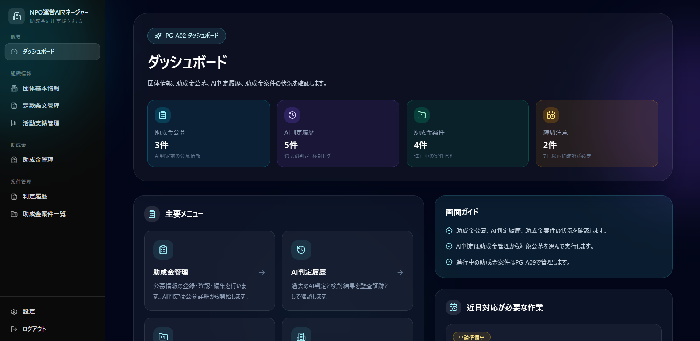
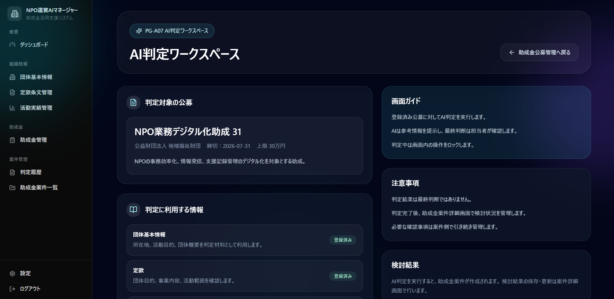
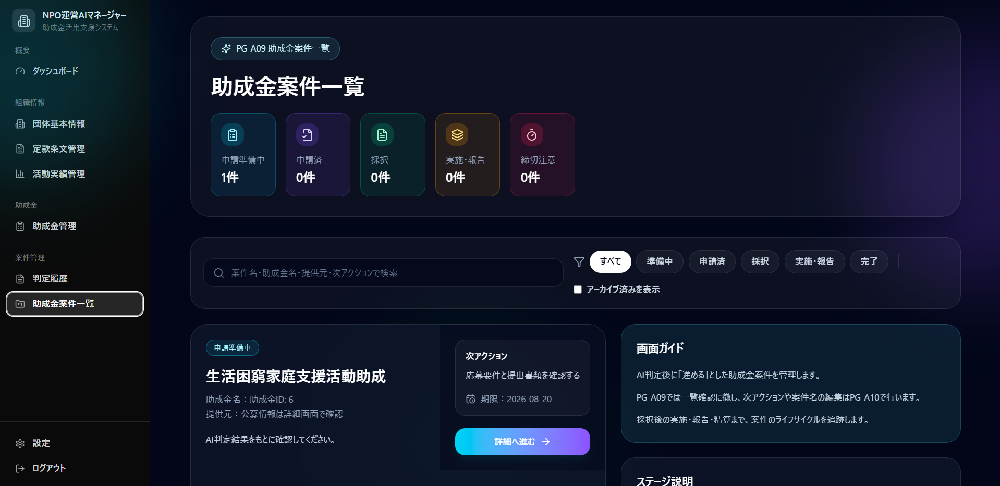
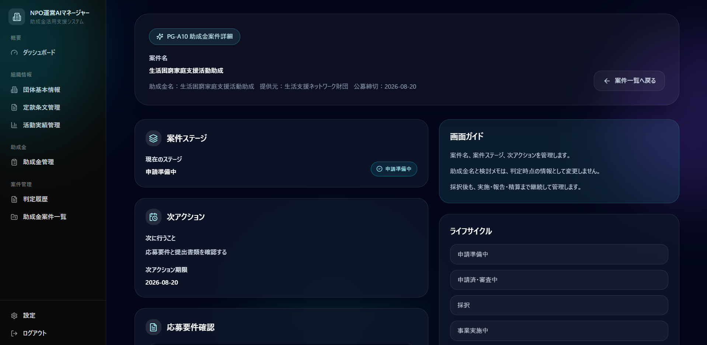
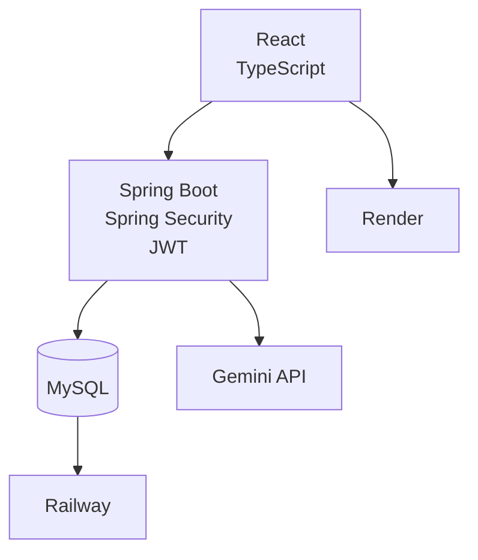

# NPO運営AIマネージャー Frontend

## 概要

NPO法人向けの助成金管理および案件管理システムのフロントエンドです。

団体情報や活動実績をもとに生成AIによる助成金適合性評価を行い、案件管理や判定履歴管理を支援することを目的としています。

ChatGPTやGeminiなどの生成AIを活用しながら、要件定義からデプロイまで一貫して個人開発を行いました。

---

## Demo

Frontend

[https://npo-ai-manager-frontend-deploy.onrender.com](https://npo-ai-manager-frontend-deploy.onrender.com)

ID : admin
pass: admin

※初回アクセス時はRenderのスリープ解除のため、表示まで数十秒かかる場合があります。

---

## Screen Shot

### Dashboard

### AI Evaluation

### Grant Case List

### Grant Case Detail

---

## System Architecture

---

## 使用技術

### Language

- TypeScript
- JavaScript
- HTML
- CSS

### Framework

- React
- React Router

### UI

- Material UI
- Radix UI
- Tailwind CSS

### HTTP Client

- Axios

### Infrastructure

- Docker

### Cloud

- Render

### Tools

- Git
- GitHub
- Visual Studio Code

---

## 主な機能

- ダッシュボード
- 団体基本情報管理
- 定款管理
- 活動実績管理
- 助成金一覧管理
- AI判定ワークスペース
- 判定履歴管理
- 助成金案件管理
- 設定画面

全13画面で構成されています。

---

## 開発工程

- 要件定義
- 画面設計
- フロントエンド実装
- API連携
- テスト
- Docker対応
- デプロイ

---

## 主な画面

- PG-A01 ログイン
- PG-A02 ダッシュボード
- PG-A03 団体基本情報
- PG-A04 定款管理
- PG-A05 活動実績管理
- PG-A06 助成金一覧
- PG-A07 AI判定ワークスペース
- PG-A08 判定履歴
- PG-A09 助成金案件一覧
- PG-A10 助成金案件詳細
- PG-A11 設定

---

## 今後の予定

- コードレビューによる継続的な改善
- READMEの拡充
- スクリーンショット追加
- 設計ドキュメント公開
- デモ環境の改善
- PDF取込機能の検討
- 知識ベース機能の検討

---

## 備考

本プロジェクトは生成AIを活用しながら開発を進めています。

コードレビューや設計の見直しを継続し、理解を深めながら改善を行っています。
