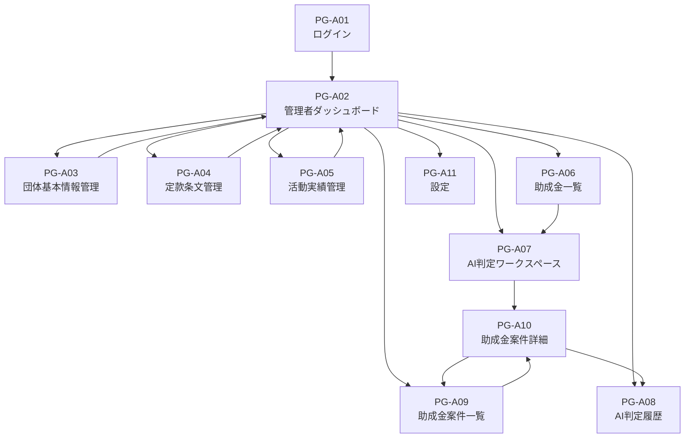
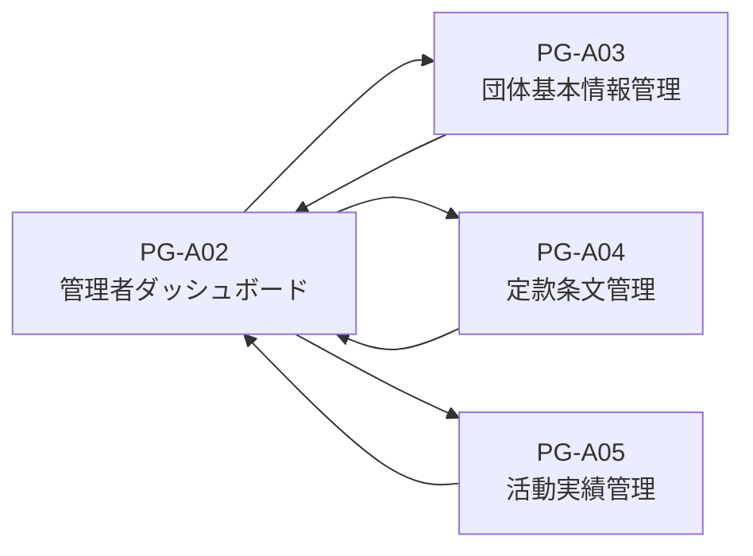
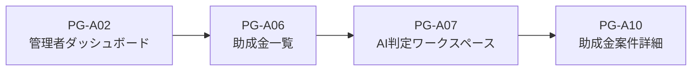
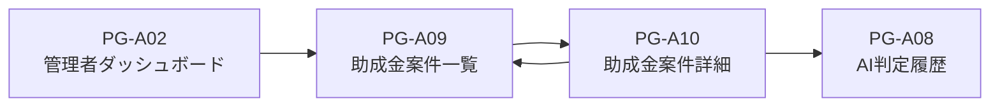
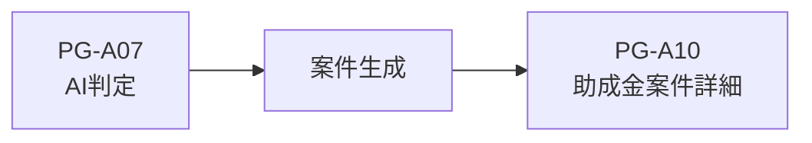

# DF-01 画面遷移図

---

# 1. 図面概要

| 項目              | 内容                       |
| ----------------- | -------------------------- |
| 図面番号          | DF-01                      |
| 図面名            | 画面遷移図                 |
| ScreenDesign      | DF-01_ScreenFlowDiagram.md |
| レイアウト説明TSX | ScreenFlowDiagram.tsx      |

---

# 2. 目的

本図面は、NPO運営AIマネージャーにおける画面間の遷移関係を整理することを目的とする。

- 画面の入口を明確にする
- 戻り先を統一する
- AI判定後の遷移を明確にする
- 実装時のルーティング不整合を防止する

---

# 3. 対象画面

```text
PG-A01 ログイン

PG-A02 管理者ダッシュボード

PG-A03 団体基本情報管理

PG-A04 定款条文管理

PG-A05 活動実績管理

PG-A06 助成金一覧

PG-A07 AI判定ワークスペース

PG-A08 AI判定履歴

PG-A09 助成金案件一覧

PG-A10 助成金案件詳細

PG-A11 設定
```

---

# 4. 基本画面遷移



---

# 5. 組織知マスタ系画面

団体情報、定款条文、活動実績は組織知マスタとして管理する。



---

# 6. 助成金探索フロー

助成金探索から案件作成までの流れを示す。



---

# 7. 案件管理フロー



---

# 8. 重要な遷移ルール

## AI判定後の遷移

AI判定完了後は、作成された案件詳細画面へ直接遷移する。



PG-A09を経由しない。

---

## マスタ系画面の戻り先

PG-A03、PG-A04、PG-A05 の戻り先は PG-A02 とする。

ブラウザバックは利用しない。

---

## 助成金案件詳細の戻り先

PG-A10 の戻り先は PG-A09 とする。

---

## 最終判断

AIは最終判断を行わない。

応募可否の最終判断は利用者が行う。
