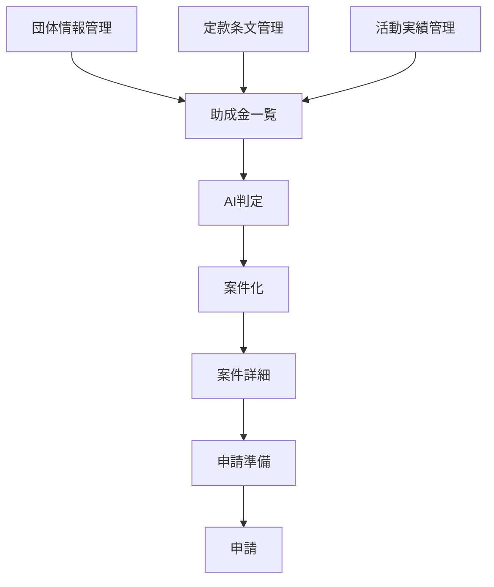
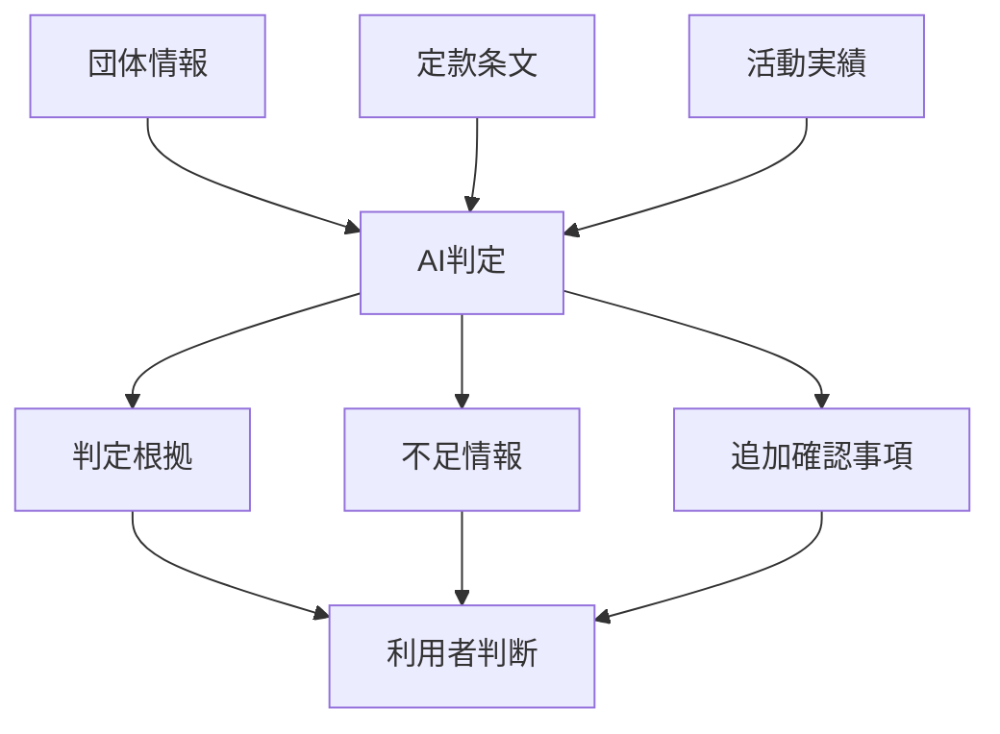
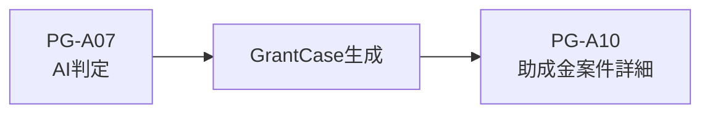
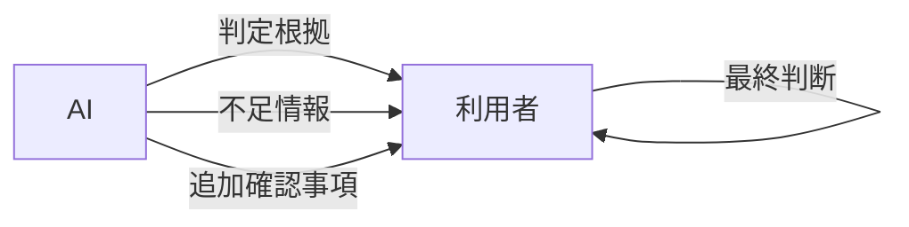
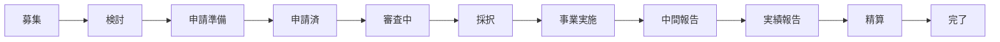

# DF-02 助成金業務フロー図

---

# 1. 図面概要

| 項目              | 内容                          |
| ----------------- | ----------------------------- |
| 図面番号          | DF-02                         |
| 図面名            | 助成金業務フロー図            |
| ScreenDesign      | DF-02_GrantWorkflowDiagram.md |
| レイアウト説明TSX | GrantWorkflowDiagram.tsx      |

---

# 2. 目的

本図面は、NPO運営AIマネージャーにおける助成金業務全体の流れを整理することを目的とする。

- 助成金検討業務を可視化する
- AIの役割と人間の役割を分離する
- AI判定履歴と案件状態の責務を分離する
- 将来の助成金ライフサイクル管理へ発展可能な構造とする

---

# 3. 基本業務フロー



---

# 4. AI判定フロー

AIは最終判断を行わない。

AIは利用者の意思決定を支援する。



---

# 5. AI判定成功時

AI判定成功時は以下を生成する。

```text
GrantCase

EvaluationHistory

RequirementCheck
```

生成完了後は、

```text
PG-A10 助成金案件詳細
```

へ遷移する。

---

# 6. AI判定履歴

EvaluationHistory は判定時点の事実を保持する。

役割

```text
監査履歴

判定根拠保存

判定スナップショット保存
```

運用方針

```text
更新しない

削除しない

アーカイブしない
```

案件状態変更の影響を受けない。

---

# 7. 応募要件確認

RequirementCheck は応募要件確認状態を管理する。

役割

```text
応募要件確認

確認状況管理
```

管理主体

```text
利用者
```

AI判定結果とは独立して管理する。

---

# 8. 次アクション

NextAction は実務タスク管理を担当する。

役割

```text
次の作業

期限管理

担当者管理
```

責務

```text
AI判定結果とは分離する

応募要件確認とは分離する

案件状態とは分離する
```

---

# 9. 案件管理

GrantCase は現在状態を管理する。

管理対象

```text
検討状況

案件ステージ

外部審査状況

アーカイブ状態
```

GrantCase は現在状態のみを保持する。

---

# 10. AI判定後の遷移



AI判定後は PG-A09 を経由しない。

---

# 11. AIと人間の責務



AIは最終判断を行わない。

応募可否の最終判断は利用者が行う。

---

# 12. 助成金ライフサイクル

将来的には以下を管理対象とする。



---

# 13. 設計原則

```text
GrantCase
↓
現在状態

EvaluationHistory
↓
監査履歴

RequirementCheck
↓
応募要件確認

NextAction
↓
実務タスク
```

それぞれの責務を混在させない。

---

# 14. MVP対象外

```text
メール送信

承認ワークフロー

会計管理

予算管理

RAG検索

ローカルLLM

Google連携

外部助成金サイト自動収集
```
