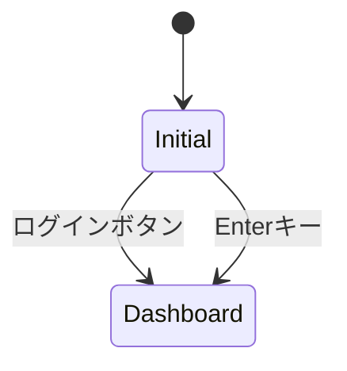
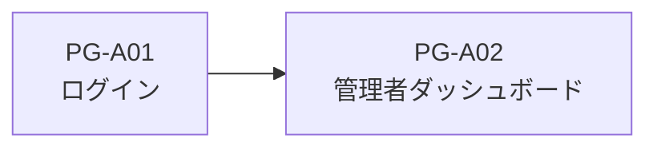

# PG-A01 ログイン

---

# 1. 基本情報

| 項目           | 内容         |
| -------------- | ------------ |
| 図面番号       | PG-A01       |
| 画面名称       | ログイン     |
| Screen Name    | LoginPage    |
| URL            | /login       |
| 利用者         | 管理者・職員 |
| 共通レイアウト | 使用しない   |

---

# 2. 画面概要

NPO運営AIマネージャーの利用開始時に表示する入口画面である。。

ログインボタン押下、または Enter キー押下により、PG-A02 管理者ダッシュボードへ遷移する。

PG-A01 は CM-L01 管理画面共通レイアウトを使用しない単独ページとする。

将来的には認証機能と連携する。

---

# 3. 画面構成

## 3-1. ヘッダーエリア

| 項目       | 内容                                                 |
| ---------- | ---------------------------------------------------- |
| システム名 | NPO運営AIマネージャー                                |
| サブコピー | 団体情報・活動実績・助成金検討を支援する管理システム |

---

## 3-2. メインエリア

### ログインカード

表示項目

```text id="w9vgv5"
メールアドレス入力欄

パスワード入力欄

ログインボタン

MVP注記
```

---

### MVP注記

```text id="ix7bkh"
MVPでは認証処理を行いません。
```

---

## 3-3. 右サイド情報パネル

PG-A01では表示しない。

---

# 4. 表示項目一覧

| 項目名         | 必須 | 内容                           |
| -------------- | ---- | ------------------------------ |
| システム名     | -    | システム名称                   |
| サブコピー     | -    | システム説明                   |
| メールアドレス | -    | MVPでは入力のみ                |
| パスワード     | -    | MVPでは入力のみ                |
| ログインボタン | -    | PG-A02へ遷移する               |
| MVP注記        | -    | 認証未実装であることを表示する |

---

# 5. 操作一覧

| 操作               | 動作             |
| ------------------ | ---------------- |
| ログインボタン押下 | PG-A02へ遷移する |
| Enterキー押下      | PG-A02へ遷移する |
| メールアドレス入力 | 入力値を保持する |
| パスワード入力     | 入力値を保持する |

---

# 6. 業務ルール

- MVPでは認証処理を行わない。
- メールアドレス、パスワードの入力値は認証判定に利用しない。
- 未入力でもログイン可能とする。
- PG-A01はCM-L01を使用しない。
- ログイン後はPG-A02へ遷移する。

---

# 7. 状態遷移



---

# 8. 他画面との関係

## 遷移元

| 画面       | 説明               |
| ---------- | ------------------ |
| 初期URL    | /login             |
| ログアウト | PG-A01へ戻る       |
| 未定義URL  | ログイン画面へ回収 |

---

## 遷移先

| 画面   | 説明                 |
| ------ | -------------------- |
| PG-A02 | 管理者ダッシュボード |

---



---

# 9. バリデーション・セキュリティガード

## MVP

バリデーションを行わない。

未入力でも PG-A02 へ遷移する。

---

## 将来実装

| 項目           | 内容                   |
| -------------- | ---------------------- |
| メールアドレス | 必須入力               |
| パスワード     | 必須入力               |
| 認証API        | 認証処理               |
| ログイン失敗   | エラー表示             |
| 権限制御       | 管理者・編集者・閲覧者 |

---

# 10. MVP実装範囲

```text id="k1vjj3"
ログイン画面表示

メールアドレス入力欄

パスワード入力欄

ログインボタン

MVP注記表示

PG-A02への遷移
```

---

# 11. 将来拡張

```text id="yadfhu"
認証API連携

JWT

セッション管理

権限管理

ログイン状態保持

パスワード再設定

ログイン履歴管理

エラー表示
```

---

# 12. 実装メモ

```text id="hnn6yl"
ログインボタンとEnterキーは同一処理とする。

将来的に認証APIを追加できる構造とする。

認証成功後はPG-A02へ遷移する。
```
