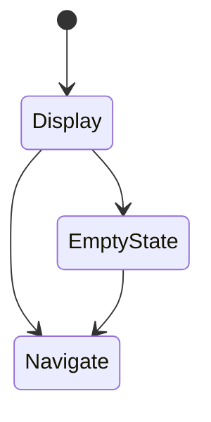
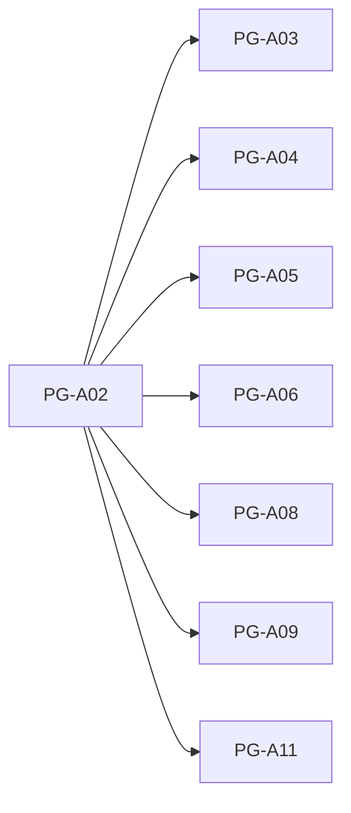

# PG-A02 管理者ダッシュボード

---

# 1. 基本情報

| 項目           | 内容                          |
| -------------- | ----------------------------- |
| 図面番号       | PG-A02                        |
| 画面名称       | 管理者ダッシュボード          |
| Screen Name    | DashboardPage                 |
| URL            | /dashboard                    |
| 利用者         | 管理者・職員                  |
| 共通レイアウト | CM-L01 管理画面共通レイアウト |

---

# 2. 画面概要

NPO運営AIマネージャー全体の状況を確認する。

助成金案件、AI判定状況、締切状況、組織情報登録状況を一覧で把握し、必要な管理画面へ移動する入口として利用する。

本画面は登録・編集画面ではなく、状況確認および画面遷移を目的とする。

---

# 3. 画面構成

## 3-1. ヘッダーエリア

| 項目         | 内容                         |
| ------------ | ---------------------------- |
| 画面タイトル | 管理者ダッシュボード         |
| 説明文       | システム全体の状況を確認する |

---

## 3-2. メインエリア

### サマリーカードエリア

```text
助成金案件数

未確認案件数

検討中案件数

締切間近件数

採択件数

不採択件数
```

---

### 今週の締切エリア

```text
助成金名

助成元

募集締切

締切状態
```

表示対象

```text
募集締切日が7日以内
```

---

### 検討中案件エリア

```text
助成金名

助成元

検討状況

外部審査結果

最終更新日
```

表示対象

```text
検討状況 = 検討中
```

---

### 未確認案件エリア

```text
助成金名

助成元

AI適合性

AI推奨度

案件作成日
```

表示対象

```text
検討状況 = 未確認
```

---

### 組織情報登録状況エリア

```text
団体基本情報

定款条文

活動実績
```

役割

```text
AI判定に必要な基礎情報の登録状況を確認する
```

---

### 最近のAI判定エリア

```text
助成金名

AI適合性

AI推奨度

AI判定日時
```

---

### EmptyState

未登録状態では、情報表示のみで終了せず、対象管理画面への誘導を行う。

対象

```text
団体基本情報

定款条文

活動実績
```

---

## 3-3. 右サイド情報パネル

| 項目     | 内容                                             |
| -------- | ------------------------------------------------ |
| 初期表示 | OFF                                              |
| 折り畳み | 可                                               |
| 表示内容 | AI判定に必要な情報、締切間近説明、未確認案件説明 |

---

# 4. 表示項目一覧

| 項目名           | 必須 | 内容                         |
| ---------------- | ---- | ---------------------------- |
| 助成金案件数     | ○    | 登録済案件総数               |
| 未確認案件数     | ○    | 未確認案件数                 |
| 検討中案件数     | ○    | 検討中案件数                 |
| 締切間近件数     | ○    | 締切間近案件数               |
| 採択件数         | -    | 採択案件数                   |
| 不採択件数       | -    | 不採択案件数                 |
| 組織情報登録状況 | ○    | AI判定に必要な情報の登録状況 |
| 最近のAI判定     | -    | 最新AI判定履歴               |

---

# 5. 操作一覧

| 操作                 | 動作             |
| -------------------- | ---------------- |
| 団体基本情報へ移動   | PG-A03へ遷移     |
| 定款条文管理へ移動   | PG-A04へ遷移     |
| 活動実績管理へ移動   | PG-A05へ遷移     |
| 助成金一覧へ移動     | PG-A06へ遷移     |
| AI判定履歴へ移動     | PG-A08へ遷移     |
| 助成金案件一覧へ移動 | PG-A09へ遷移     |
| 設定へ移動           | PG-A11へ遷移     |
| 右パネル開閉         | 補足情報表示切替 |

---

# 6. 業務ルール

- 本画面は状況確認と画面遷移を目的とする。
- 本画面では登録・編集を行わない。
- AI判定に必要な基礎情報の登録状況を確認できるようにする。
- 未登録状態では対象画面へのショートカットを表示する。
- 締切間近案件を優先表示する。
- AI判定結果は参考情報として表示する。
- 応募可否の最終判断は利用者が行う。

---

## EmptyState方針

EmptyState は情報表示だけで終了しない。

必ず対象画面へ誘導する。

---

# 7. 状態遷移



---

# 8. 他画面との関係



本画面は

```text
システム入口

状況確認

画面ナビゲーション
```

を担当する。

---

# 9. バリデーション・セキュリティガード

本画面は参照専用画面である。

入力バリデーションは行わない。

個人情報は表示しない。

---

### AI判定結果の扱い

表示文

```text
AI判定結果は参考情報です。

応募可否の最終判断は利用者が行います。
```

---

### 未登録情報ガード

以下が未登録の場合は注意表示を行う。

```text
団体基本情報

定款条文

活動実績
```

---

# 10. MVP実装範囲

```text
サマリーカード表示

今週の締切表示

検討中案件表示

未確認案件表示

組織情報登録状況表示

最近のAI判定表示

EmptyState表示

各管理画面への遷移

右サイド情報パネル
```

---

# 11. 将来拡張

```text
採択率分析

不採択分析

案件推移グラフ

締切カレンダー

通知機能

メール連携

RAG検索

ローカルLLM

ダッシュボードカスタマイズ
```

---

# 12. 実装メモ

```text
PG-A02のみ右サイド情報パネルは初期非表示とする。

EmptyStateでは対象管理画面へ誘導する。

締切状態は

NORMAL

NEAR_DEADLINE

EXPIRED

を利用する。

最近のAI判定は最新データを表示する。
```
