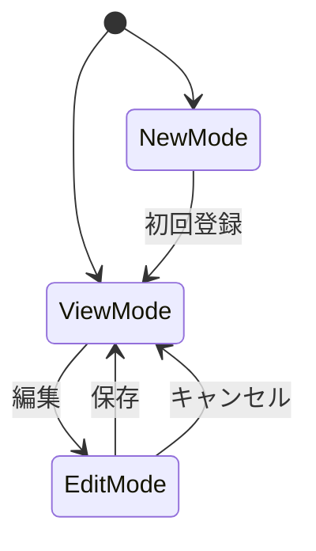
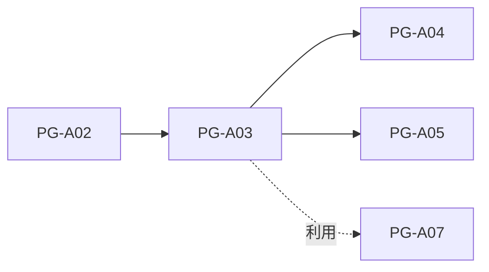

# PG-A03 団体基本情報管理

---

# 1. 基本情報

| 項目           | 内容                          |
| -------------- | ----------------------------- |
| 図面番号       | PG-A03                        |
| 画面名称       | 団体基本情報管理              |
| Screen Name    | OrganizationProfilePage       |
| URL            | /organization-profile         |
| 利用者         | 管理者・職員                  |
| 共通レイアウト | CM-L01 管理画面共通レイアウト |

---

# 2. 画面概要

団体の基本情報を登録・管理する。

本画面で登録された情報は、AI判定時の基礎情報として利用される。

MVPでは単一団体運用とする。

---

# 3. 画面構成

## 3-1. ヘッダーエリア

| 項目         | 内容                                     |
| ------------ | ---------------------------------------- |
| 画面タイトル | 団体基本情報管理                         |
| 説明文       | AI判定で利用する団体の基本情報を管理する |

---

## 3-2. メインエリア

| No  | 項目名         | 内容                                             |
| --- | -------------- | ------------------------------------------------ |
| 1   | 基本情報エリア | 団体名、法人種別、住所、連絡先等を表示・編集する |
| 2   | 団体概要エリア | 団体概要、活動目的を表示・編集する               |
| 3   | 参照モード     | 登録済み情報を表示する                           |
| 4   | 編集モード     | 登録済み情報を編集する                           |
| 5   | 新規入力モード | 未登録時に初回登録フォームを表示する             |

---

## 3-3. 右サイド情報パネル

| 項目     | 内容                                   |
| -------- | -------------------------------------- |
| 初期表示 | ON                                     |
| 折り畳み | 可                                     |
| 表示内容 | 登録状況、最終更新日時、AI判定利用項目 |

---

# 4. 表示項目一覧

| 項目名         | 必須 | 内容                    |
| -------------- | ---- | ----------------------- |
| 団体名         | ○    | 団体の正式名称          |
| 法人種別       | -    | NPO法人、一般社団法人等 |
| 設立年月日     | -    | 団体設立日              |
| 代表者名       | -    | 団体代表者名            |
| 郵便番号       | -    | 郵便番号                |
| 住所           | -    | 団体所在地              |
| 電話番号       | -    | 団体連絡先              |
| メールアドレス | -    | 団体連絡先              |
| Webサイト      | -    | 団体公式サイト          |
| 団体概要       | ○    | 団体概要                |
| 活動目的       | ○    | 団体の活動目的          |

---

# 5. 操作一覧

| 操作       | 動作                   |
| ---------- | ---------------------- |
| 編集       | 編集モードへ切り替える |
| 保存       | 入力内容を保存する     |
| キャンセル | 編集内容を破棄する     |
| 戻る       | PG-A02へ戻る           |

---

# 6. 業務ルール

- MVPでは単一団体運用とする。
- 団体基本情報は実質1レコードで運用する。
- 将来的な複数団体対応を考慮しID管理を継続する。
- 未登録時は新規入力モードを表示する。
- 団体概要および活動目的はAI判定の基礎情報として利用する。
- 個人情報および機微情報は入力しない。
- 定款情報は PG-A04 で管理する。
- 活動実績は PG-A05 で管理する。

---

# 7. 状態遷移



---

## 保存中

保存処理中は画面内ローカルロックを利用する。

目的

```text
二重登録防止

二重更新防止

保存中の画面離脱防止
```

---

# 8. 他画面との関係



---

## 戻り先ルール

戻るボタンおよびキャンセルボタン押下時はブラウザバックを利用しない。

戻り先は必ず PG-A02 管理者ダッシュボードとする。

---

# 9. バリデーション・セキュリティガード

## 入力バリデーション

| 項目           | 条件         | エラーメッセージ                       |
| -------------- | ------------ | -------------------------------------- |
| 団体名         | 必須         | 団体名を入力してください               |
| 団体概要       | 必須         | 団体概要を入力してください             |
| 活動目的       | 必須         | 活動目的を入力してください             |
| メールアドレス | 形式チェック | メールアドレスの形式が正しくありません |

---

## 文字数制限

| 項目      | 最大文字数 |
| --------- | ---------- |
| 団体名    | 200文字    |
| 団体概要  | 3000文字   |
| 活動目的  | 3000文字   |
| Webサイト | 500文字    |

---

## セキュリティ・テキストガード

団体概要および活動目的入力欄では以下を表示する。

```text
個人情報や機微情報を入力しないでください。

利用者氏名
住所
連絡先
相談内容
医療情報
障害情報
支援記録

などの記載は禁止します。
```

目的

```text
AI判定プロンプトへの不要情報混入防止
```

---
