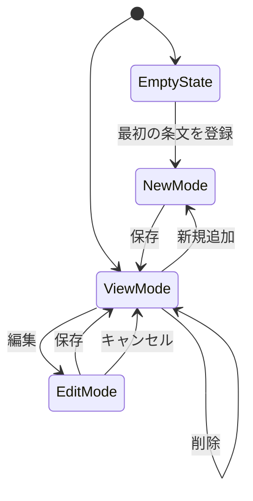

# PG-A04 定款条文管理

---

# 1. 基本情報

| 項目           | 内容                          |
| -------------- | ----------------------------- |
| 図面番号       | PG-A04                        |
| 画面名称       | 定款条文管理                  |
| Screen Name    | ArticlePage                   |
| URL            | /articles                     |
| 利用者         | 管理者・職員                  |
| 共通レイアウト | CM-L01 管理画面共通レイアウト |

---

# 2. 画面概要

定款条文を登録・管理する。

登録された定款条文はAI判定の根拠として利用される。

将来的な組織知識ベースおよびRAG検索の基礎データとして利用する。

---

# 3. 画面構成

## 3-1. ヘッダーエリア

| 項目         | 内容                               |
| ------------ | ---------------------------------- |
| 画面タイトル | 定款条文管理                       |
| 説明文       | AI判定で利用する定款条文を管理する |

---

## 3-2. メインエリア

### 左右分割レイアウト

```text
左側
定款条文一覧

右側
定款条文詳細
```

---

### 定款条文一覧エリア

表示項目

```text
条番号

条文タイトル
```

役割

```text
登録済み定款条文を一覧表示する
```

---

### 定款条文詳細エリア

表示項目

```text
条番号

条文タイトル

条文本文
```

役割

```text
選択中の定款条文を確認する
```

---

### EmptyState

定款条文が登録されていない場合は、

```text
定款条文が登録されていません。
```

を表示する。

対象画面への誘導を行う。

---

## 3-3. 右サイド情報パネル

| 項目     | 内容                                     |
| -------- | ---------------------------------------- |
| 初期表示 | ON                                       |
| 折り畳み | 可                                       |
| 表示内容 | 登録条文数、最終更新日時、AI判定利用内容 |

---

# 4. 表示項目一覧

| 項目名       | 必須 | 内容         |
| ------------ | ---- | ------------ |
| 条番号       | ○    | 定款条番号   |
| 条文タイトル | ○    | 条文タイトル |
| 条文本文     | ○    | 条文内容     |

---

# 5. 操作一覧

| 操作       | 動作                 |
| ---------- | -------------------- |
| 新規追加   | 新しい条文を登録する |
| 編集       | 条文を編集する       |
| 保存       | 入力内容を保存する   |
| 削除       | 条文を削除する       |
| キャンセル | 編集内容を破棄する   |
| 戻る       | PG-A02へ戻る         |

---

# 6. 業務ルール

- MVPでは単一団体運用とする。
- 同一団体内で条番号の重複を禁止する。
- 定款条文はAI判定根拠として利用する。
- 定款条文が0件の場合はEmptyStateを表示する。
- 履歴系データとは削除方針を分離する。

---

## 削除方針

定款条文はマスタデータとして扱う。

入力ミスや重複登録の修正を容易にするため、物理削除を許容する。

履歴系データとは削除方針を分離する。

---

# 7. 状態遷移



---

## 保存中

保存処理中は画面内ローカルロックを利用する。

目的

```text
二重登録防止

二重更新防止

削除処理重複防止
```

---

# 8. 他画面との関係


---

## 戻り先ルール

ブラウザバックは利用しない。

戻り先は必ず PG-A02 管理者ダッシュボードとする。

---

# 9. バリデーション・セキュリティガード

## 入力バリデーション

### 条番号重複チェック

同一団体内で同一条番号の登録を禁止する。

表示メッセージ

```text
第◯条は既に登録されています。
```

---

### データ整合性

フロントエンドのチェックとは別に、バックエンド側でも重複登録を禁止する。

---

## セキュリティ・テキストガード

条文本文入力欄では以下を表示する。

```text
個人情報や機微情報を入力しないでください。

利用者氏名
住所
連絡先
相談内容
医療情報
障害情報
支援記録

などの記載は禁止します。
```

目的

```text
AI判定プロンプトへの不要情報混入防止

将来のRAG検索時のプライバシー漏洩防止

ローカルLLM利用時の入力データ安全性確保
```

---

# 10. MVP実装範囲

```text
一覧表示

詳細表示

新規追加

編集

削除

EmptyState

条番号重複チェック

右サイド情報パネル表示
```

---

# 11. 将来拡張

```text
定款PDF

OCR

PDF解析

RAG検索

ローカルLLM

定款版管理

変更履歴管理

PDF原本保存
```

---

# 12. 実装メモ

```text
一覧と詳細を連動させる。

EmptyStateでは対象操作へ誘導する。

保存中は画面内ローカルロックを利用する。

将来的なPDF取込およびKnowledge化を考慮する。

重複チェックはフロントエンドとバックエンドの両方で行う。
```
