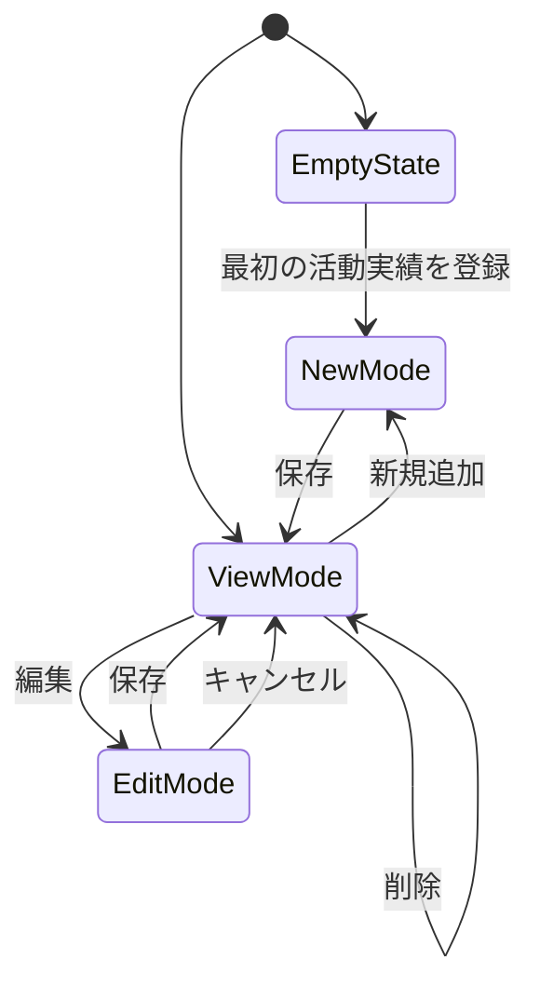

# PG-A05 活動実績管理

---

# 1. 基本情報

| 項目           | 内容                          |
| -------------- | ----------------------------- |
| 図面番号       | PG-A05                        |
| 画面名称       | 活動実績管理                  |
| Screen Name    | ProjectPage                   |
| URL            | /projects                     |
| 利用者         | 管理者・職員                  |
| 共通レイアウト | CM-L01 管理画面共通レイアウト |

---

# 2. 画面概要

団体の活動実績を登録・管理する。

登録された活動実績はAI判定時の重要な根拠として利用される。

活動内容や成果を構造化して管理することで、将来的な組織知識ベースおよびRAG検索の基礎データとして利用する。

---

# 3. 画面構成

## 3-1. ヘッダーエリア

| 項目         | 内容                               |
| ------------ | ---------------------------------- |
| 画面タイトル | 活動実績管理                       |
| 説明文       | AI判定に利用する活動実績を管理する |

---

## 3-2. メインエリア

### 左右分割レイアウト

```text
左側
活動実績一覧

右側
活動実績詳細
```

---

### 活動実績一覧エリア

表示項目

```text
実施年度

事業名

活動内容（概要）
```

役割

```text
登録済み活動実績を一覧表示する
```

---

### 活動実績詳細エリア

表示項目

```text
実施年度

事業名

活動内容

成果

添付資料ファイル名
```

役割

```text
活動実績の詳細を確認する
```

---

### EmptyState

活動実績が登録されていない場合は、

```text
まだ活動実績が登録されていません。
```

を表示する。

対象操作への誘導を行う。

---

## 3-3. 右サイド情報パネル

| 項目     | 内容                                   |
| -------- | -------------------------------------- |
| 初期表示 | ON                                     |
| 折り畳み | 可                                     |
| 表示内容 | 登録件数、最終更新日時、AI判定利用内容 |

---

# 4. 表示項目一覧

| 項目名             | 必須 | 内容               |
| ------------------ | ---- | ------------------ |
| 実施年度           | ○    | 活動を実施した年度 |
| 事業名             | ○    | 活動名称           |
| 活動内容           | ○    | 活動概要           |
| 成果               | ○    | 活動結果           |
| 添付資料ファイル名 | -    | 関連資料ファイル名 |

---

# 5. 操作一覧

| 操作       | 動作                     |
| ---------- | ------------------------ |
| 新規追加   | 新しい活動実績を登録する |
| 編集       | 活動実績を編集する       |
| 保存       | 入力内容を保存する       |
| 削除       | 活動実績を削除する       |
| キャンセル | 編集内容を破棄する       |
| 戻る       | PG-A02へ戻る             |

---

# 6. 業務ルール

- 活動実績はAI判定根拠として利用する。
- MVPでは単一団体運用とする。
- 同一年度・同一事業名の重複登録を禁止する。
- 活動実績が0件の場合はEmptyStateを表示する。
- 活動実績はマスタデータとして扱う。
- 入力ミスや重複登録修正のため物理削除を許容する。
- 履歴系データとは削除方針を分離する。

---

## 成果入力方針

成果は可能な範囲で定量的に記載する。

例

```text
年間延べ240名参加

月2回継続開催

利用者満足度95%

参加者アンケート20件回収

ボランティア登録者15名
```

長い日記形式ではなく、

```text
活動結果が分かる短い文章
```

を推奨する。

---

## 添付資料の位置付け

添付資料は、

```text
活動報告書

事業報告書

実績報告書
```

などとの紐付け情報として利用する。

将来的な

```text
OCR

PDF解析

RAG検索
```

の対象とする。

---

# 7. 状態遷移



---

## 保存中

保存処理中は画面内ローカルロックを利用する。

目的

```text
二重登録防止

二重更新防止

保存中の画面離脱防止
```

---

# 8. 他画面との関係


---

## 戻り先ルール

ブラウザバックは利用しない。

戻り先は必ず PG-A02 管理者ダッシュボードとする。

---

# 9. バリデーション・セキュリティガード

## 入力バリデーション

| 項目     | 条件 | エラーメッセージ           |
| -------- | ---- | -------------------------- |
| 実施年度 | 必須 | 実施年度を入力してください |
| 事業名   | 必須 | 事業名を入力してください   |
| 活動内容 | 必須 | 活動内容を入力してください |
| 成果     | 必須 | 成果を入力してください     |

---

## 重複チェック

同一団体内で

```text
同一年度

同一事業名
```

の登録を禁止する。

表示メッセージ

```text
2025年度の子ども食堂運営は既に登録されています。
```

---

## データ整合性

フロントエンドのチェックとは別に、バックエンド側でも重複登録を禁止する。

---

## セキュリティ・テキストガード

活動内容および成果入力欄では以下を表示する。

```text
個人情報や機微情報を入力しないでください。

利用者氏名
住所
連絡先
相談内容
医療情報
障害情報
支援記録

などの記載は禁止します。
```

目的

```text
AI判定プロンプトへの不要情報混入防止

将来のRAG検索時のプライバシー漏洩防止

ローカルLLM利用時の入力データ安全性確保
```

---

# 10. MVP実装範囲

```text
活動実績一覧表示

活動実績詳細表示

新規登録

編集

削除

EmptyState

重複チェック

添付資料ファイル名管理

右サイド情報パネル表示
```

---

# 11. 将来拡張

```text
PDF添付

活動報告書管理

事業報告書管理

OCR

PDF解析

RAG検索

ローカルLLM

活動実績版管理

変更履歴管理

PDF原本保存
```

---

# 12. 実装メモ

```text
一覧と詳細を連動させる。

EmptyStateでは対象操作へ誘導する。

保存中は画面内ローカルロックを利用する。

将来的な添付ファイル管理およびKnowledge化を考慮する。

重複チェックはフロントエンドとバックエンドの両方で行う。
```
