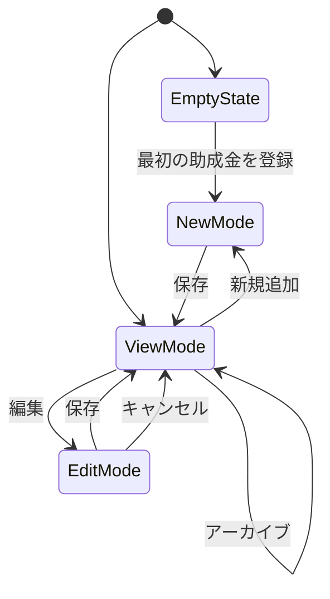
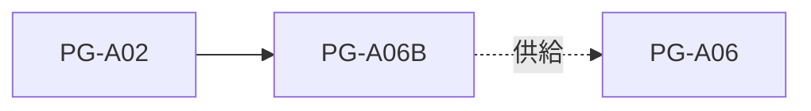

# PG-A06B 助成金マスター管理

---

# 1. 基本情報

| 項目           | 内容                          |
| -------------- | ----------------------------- |
| 図面番号       | PG-A06B                       |
| 画面名称       | 助成金マスター管理            |
| Screen Name    | GrantFormPage                 |
| URL            | /grant-management             |
| 利用者         | 管理者                        |
| 共通レイアウト | CM-L01 管理画面共通レイアウト |

---

# 2. 画面概要

助成金マスターを登録・管理する。

登録された助成金情報は PG-A06 助成金一覧で利用される。

本画面は管理者専用画面とし、助成金の作成・編集・アーカイブを担当する。

---

# 3. 画面構成

## 3-1. ヘッダーエリア

| 項目         | 内容                       |
| ------------ | -------------------------- |
| 画面タイトル | 助成金マスター管理         |
| 説明文       | 助成金情報を登録・管理する |

---

## 3-2. メインエリア

### 助成金一覧エリア

表示項目

```text
募集年度

助成金名

助成元

募集開始日

募集締切日

助成上限額

公開状態
```

---

### 助成金詳細エリア

表示項目

```text
募集年度

助成金名

助成元

募集開始日

募集締切日

助成上限額

募集要項要約

公開状態
```

---

### EmptyState

助成金が存在しない場合は、

```text
助成金が登録されていません。
```

を表示する。

対象操作への誘導を行う。

---

## 3-3. 右サイド情報パネル

| 項目     | 内容                         |
| -------- | ---------------------------- |
| 初期表示 | ON                           |
| 折り畳み | 可                           |
| 表示内容 | 年度管理ルール、公開状態説明 |

---

# 4. 表示項目一覧

| 項目名       | 必須 | 内容         |
| ------------ | ---- | ------------ |
| 募集年度     | ○    | 対象年度     |
| 助成金名     | ○    | 助成金名称   |
| 助成元       | ○    | 提供団体     |
| 募集開始日   | ○    | 募集開始日   |
| 募集締切日   | ○    | 募集締切日   |
| 助成上限額   | -    | 最大助成額   |
| 募集要項要約 | -    | AI判定用要約 |
| 公開状態     | ○    | 公開・非公開 |

---

# 5. 操作一覧

| 操作       | 動作                   |
| ---------- | ---------------------- |
| 新規追加   | 新しい助成金を登録する |
| 編集       | 助成金を編集する       |
| 保存       | 入力内容を保存する     |
| アーカイブ | 非公開にする           |
| キャンセル | 編集内容を破棄する     |
| 戻る       | PG-A02へ戻る           |

---

# 6. 業務ルール

- 助成金は年度ごとに別レコードとして管理する。
- 同一年度・同一助成金名の重複登録を禁止する。
- アーカイブ済み助成金は PG-A06 に表示しない。
- 削除は行わず、アーカイブで管理する。
- 締切状態はバックエンド側で算出する。

---

# 7. 状態遷移



---

# 8. 他画面との関係



---

# 9. バリデーション・セキュリティガード

## 入力バリデーション

| 項目       | 条件 |
| ---------- | ---- |
| 募集年度   | 必須 |
| 助成金名   | 必須 |
| 助成元     | 必須 |
| 募集開始日 | 必須 |
| 募集締切日 | 必須 |

---

## 重複チェック

同一年度・同一助成金名の登録を禁止する。

---

## データ整合性

フロントエンドとは別にバックエンド側でも重複登録を禁止する。

---

# 10. MVP実装範囲

```text
一覧表示

詳細表示

新規登録

編集

アーカイブ

重複チェック

EmptyState

右サイド情報パネル
```

---

# 11. 将来拡張

```text
jGrants連携

PDF取込

OCR

RAG検索

ローカルLLM

募集要項全文管理

採択率分析

助成元分析
```

---

# 12. 実装メモ

```text
年度単位で別レコード管理する。

削除ではなくアーカイブで管理する。

締切状態はバックエンド側で算出する。

PG-A06へのデータ供給元として利用する。

将来的な外部助成金サービス連携を考慮する。
```
