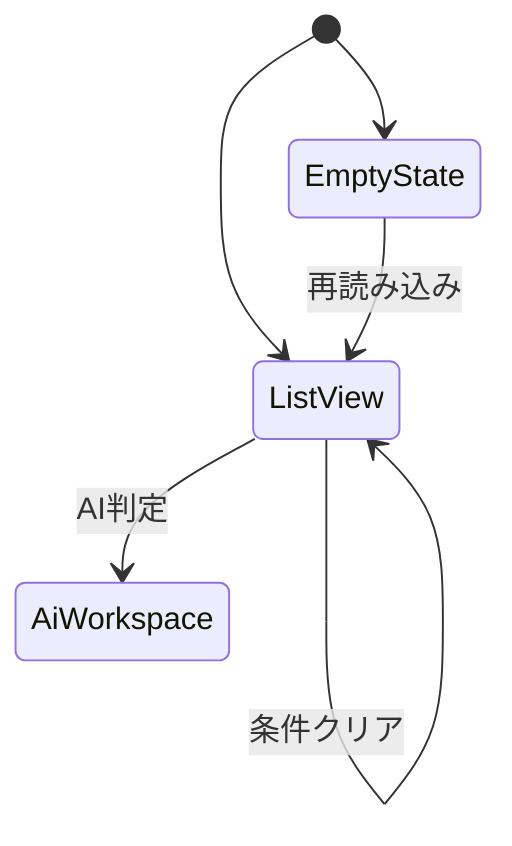
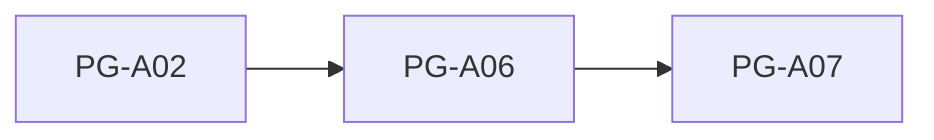

# PG-A06 助成金一覧

---

# 1. 基本情報

| 項目           | 内容                          |
| -------------- | ----------------------------- |
| 図面番号       | PG-A06                        |
| 画面名称       | 助成金一覧                    |
| Screen Name    | GrantListPage                 |
| URL            | /grants                       |
| 利用者         | 管理者・職員                  |
| 共通レイアウト | CM-L01 管理画面共通レイアウト |

---

# 2. 画面概要

登録済み助成金情報を検索・閲覧し、応募候補となる助成金を探す。

利用者は助成金情報を確認し、必要に応じてAI判定を実行する。

本画面は助成金マスターの閲覧専用画面であり、登録・編集・削除は行わない。

---

# 3. 画面構成

## 3-1. ヘッダーエリア

| 項目         | 内容               |
| ------------ | ------------------ |
| 画面タイトル | 助成金一覧         |
| 登録助成金数 | 登録済み助成金件数 |
| 締切間近件数 | 締切間近助成金件数 |

---

## 3-2. メインエリア

### 検索・絞り込みエリア

検索項目

```text
助成金名

助成元

キーワード
```

キーワード検索対象

```text
助成金名

助成元

募集年度

募集要項要約
```

絞り込み項目

```text
締切状態
```

---

### 助成金一覧テーブル

表示項目

```text
募集年度

助成金名

助成元

募集締切

締切状態

助成上限額
```

---

### 締切状態

```text
NORMAL
→ 募集中

NEAR_DEADLINE
→ 締切間近

EXPIRED
→ 期限切れ
```

---

### AI判定ボタン表示条件

```text
NORMAL
→ 表示

NEAR_DEADLINE
→ 表示

EXPIRED
→ 非表示
```

期限切れ助成金はAI判定対象外とする。

---

### EmptyState

助成金データが存在しない場合は、

```text
現在公開中の助成金はありません。
```

を表示する。

対象操作への誘導を行う。

---

## 3-3. 右サイド情報パネル

| 項目     | 内容                                         |
| -------- | -------------------------------------------- |
| 初期表示 | ON                                           |
| 折り畳み | 可                                           |
| 表示内容 | 助成金検索方法、締切状態説明、AI判定利用方法 |

---

# 4. 表示項目一覧

| 項目名     | 必須 | 内容                       |
| ---------- | ---- | -------------------------- |
| 募集年度   | ○    | 募集対象年度               |
| 助成金名   | ○    | 助成金名称                 |
| 助成元     | ○    | 提供団体名                 |
| 募集締切   | ○    | 応募締切日                 |
| 締切状態   | ○    | 募集中・締切間近・期限切れ |
| 助成上限額 | -    | 最大助成金額               |

---

# 5. 操作一覧

| 操作       | 動作                 |
| ---------- | -------------------- |
| AI判定     | PG-A07へ遷移する     |
| 検索       | 条件で絞り込む       |
| 条件クリア | 検索条件を初期化する |
| 再読み込み | 一覧を再取得する     |

---

# 6. 業務ルール

- 助成金マスターは参照専用で管理する。
- 助成金マスターの登録・編集・削除は行わない。
- 期限切れ助成金はAI判定対象外とする。
- 締切状態はバックエンド側で判定する。
- 年度ごとに別助成金マスターとして管理する。
- 検索条件は画面復帰時に復元する。

---

## 助成金年度管理

同じ名称の助成金であっても、

```text
募集期間

締切日

助成上限額

応募要件

審査基準
```

が変化する可能性がある。

そのため年度ごとに別レコードとして管理する。

---

# 7. 状態遷移



---

# 8. 他画面との関係



---

## 戻り先ルール

AI判定ワークスペースから一覧へ戻る場合は、検索条件を維持する。

---

# 9. バリデーション・セキュリティガード

## 検索条件

| 項目       | 条件 |
| ---------- | ---- |
| キーワード | 任意 |
| 助成元     | 任意 |
| 締切状態   | 任意 |

---

## AI判定実行ガード

以下の場合はAI判定ボタンを表示しない。

```text
deadlineStatus = EXPIRED
```

目的

```text
期限切れ助成金に対する不要なAI判定実行防止
```

---

## テキストガード

本画面では利用者入力データを保存しない。

そのため自由入力欄に対するセキュリティガードは不要とする。

---

# 10. MVP実装範囲

```text
助成金一覧表示

検索

絞り込み

締切状態表示

AI判定遷移

検索条件保持

検索条件復元

EmptyState
```

---

# 11. 将来拡張

```text
jGrants連携

助成金自動収集

募集要項PDF解析

RAG検索

ローカルLLM

採択率分析

助成元分析

助成金レコメンド機能
```

---

# 12. 実装メモ

```text
検索条件は画面復帰時に復元する。

期限切れ助成金ではAI判定を実行しない。

締切状態の算出はバックエンド側で行う。

助成金マスターは参照専用として扱う。

将来的な外部助成金サービス連携を考慮する。
```
