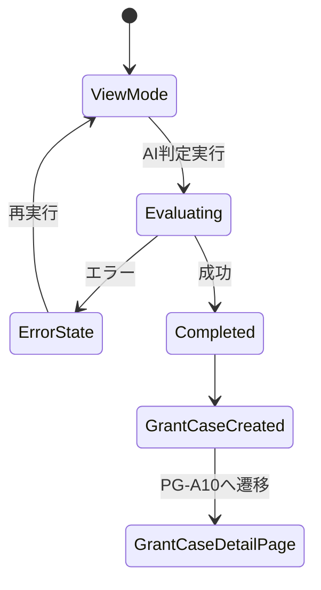
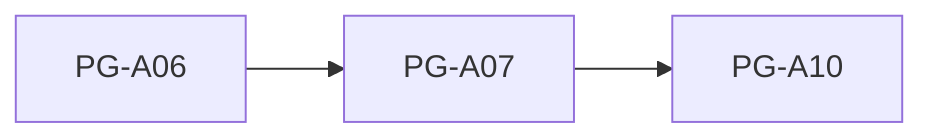

# PG-A07 AI判定ワークスペース

---

# 1. 基本情報

| 項目           | 内容                          |
| -------------- | ----------------------------- |
| 図面番号       | PG-A07                        |
| 画面名称       | AI判定ワークスペース          |
| Screen Name    | AiWorkSpacePage               |
| URL            | /ai-workspace/:grantMasterId  |
| 利用者         | 管理者・職員                  |
| 共通レイアウト | CM-L01 管理画面共通レイアウト |

---

# 2. 画面概要

団体基本情報、定款条文、活動実績および助成金情報をもとにAI判定を実行する。

AIは最終判断を行わず、助成金案件を検討するための材料を生成する。

AI判定完了後は助成金案件を生成し、PG-A10 助成金案件詳細へ遷移する。

本画面は助成金マスターを助成金案件へ変換する入口画面である。

---

# 3. 画面構成

## 3-1. ヘッダーエリア

| 項目         | 内容                                         |
| ------------ | -------------------------------------------- |
| 画面タイトル | AI判定ワークスペース                         |
| 説明文       | 助成金情報と団体情報をもとにAI判定を実行する |
| 表示情報     | 助成金名、助成元、募集締切                   |

---

## 3-2. メインエリア

### 判定対象助成金エリア

表示項目

```text
助成金名

助成元

募集年度

募集締切

助成上限額

募集要項要約

募集テーマ

対象事業

対象団体

対象地域

提出書類

公式URL
```

---

### AI判定利用データ確認エリア

表示項目

```text
団体基本情報

定款条文

活動実績
```

役割

```text
AIへ渡される情報を利用者が確認する
```

---

### 不足情報警告

以下の情報が不足している場合は警告表示する。

```text
団体基本情報

定款条文

活動実績
```

AI判定は実行可能とする。

理由

```text
追加確認事項や不足情報の洗い出しにも利用するため
```

---

### AI判定実行エリア

表示項目

```text
AI判定実行ボタン

判定中表示

エラー表示
```

---

### AI判定結果エリア

表示項目

```text
AI適合性判定

AI推奨度

AI判定理由

追加確認事項

不足情報
```

AI適合性

```text
適合

要確認

不適合
```

AI推奨度

```text
A

B

C
```

---

## 3-3. 右サイド情報パネル

| 項目     | 内容                                         |
| -------- | -------------------------------------------- |
| 初期表示 | ON                                           |
| 折り畳み | 可                                           |
| 表示内容 | AI判定の説明、判定結果の見方、不足情報の説明 |

---

# 4. 表示項目一覧

| 項目名       | 必須 | 内容           |
| ------------ | ---- | -------------- |
| 助成金名     | ○    | 判定対象助成金 |
| 助成元       | ○    | 提供団体       |
| 団体基本情報 | ○    | AI判定根拠     |
| 定款条文     | ○    | AI判定根拠     |
| 活動実績     | ○    | AI判定根拠     |
| AI適合性判定 | -    | AI判定結果     |
| AI推奨度     | -    | AI推奨ランク   |
| AI判定理由   | -    | 判定理由       |
| 追加確認事項 | -    | 利用者確認事項 |
| 不足情報     | -    | 未登録情報     |

---

# 5. 操作一覧

| 操作               | 動作               |
| ------------------ | ------------------ |
| AI判定実行         | AI判定を実行する   |
| 戻る               | PG-A06へ戻る       |
| 右サイドパネル開閉 | 補足情報を表示する |

---

# 6. 業務ルール

- AIは最終判断を行わない。
- AI判定結果は検討材料として利用する。
- 最終判断は利用者が行う。
- AI判定完了後は PG-A10 へ直接遷移する。
- PG-A09 は経由しない。
- 判定対象助成金は grantMasterId により特定する。
- 情報不足があってもAI判定は実行可能とする。
- AI判定実行中は全画面インフラロックを利用する。

---

## AI判定成功時

以下を生成する。

```text
GrantCase

EvaluationHistory

GrantRequirementsCheck
```

生成後、返却された grantCaseId を利用して PG-A10 へ遷移する。

---

## AIの位置付け

AI判定は応募可否の最終決定ではない。

利用者は、

```text
募集要項

応募要件

提出書類

活動実績

追加確認事項

不足情報
```

を確認し、最終判断を行う。

---

# 7. 状態遷移



---

## 操作ロック

AI判定実行中は全画面インフラロックを利用する。

目的

```text
二重判定防止

二重登録防止

画面遷移防止
```

表示

```text
AI判定中です。

しばらくお待ちください。
```

---

## 操作ロック

AI判定実行中は全画面インフラロックを利用する。

目的

```text
二重判定防止

二重登録防止

画面遷移防止
```

表示

```text
AI判定中です。

しばらくお待ちください。
```

---

# 8. 他画面との関係



---

## 遷移ルール

AI判定成功後は

```text
PG-A07

↓

PG-A10
```

の固定ルートとする。

PG-A09 は経由しない。

---

# 9. バリデーション・セキュリティガード

## grantMasterIdガード

判定対象助成金が存在しない場合はAI判定を実行しない。

表示内容

```text
判定対象の助成金が指定されていません。

助成金一覧から対象助成金を選択してください。
```

---

## 不足情報ガード

以下が未登録の場合は警告表示する。

```text
団体基本情報

定款条文

活動実績
```

---

## セキュリティ・テキストガード

以下を表示する。

```text
個人情報や機微情報を含めないでください。

利用者氏名

住所

連絡先

相談内容

医療情報

障害情報

支援記録

などの記載は禁止します。
```

目的

```text
AI判定プロンプトへの不要情報混入防止
```

---`
