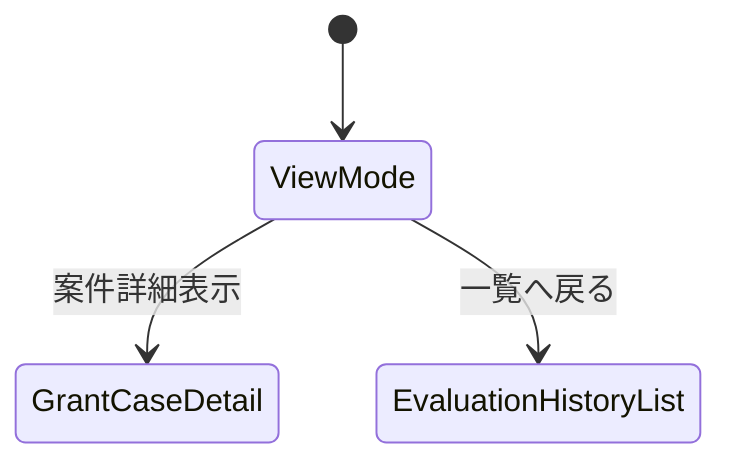
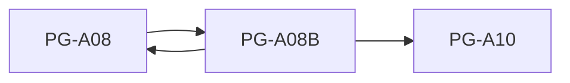

# PG-A08B AI判定履歴詳細

---

# 1. 基本情報

| 項目           | 内容                                       |
| -------------- | ------------------------------------------ |
| 図面番号       | PG-A08B                                    |
| 画面名称       | AI判定履歴詳細                             |
| Screen Name    | EvaluationHistoryDetailPage                |
| URL            | /evaluation-histories/:evaluationHistoryId |
| 利用者         | 管理者・職員                               |
| 共通レイアウト | CM-L01 管理画面共通レイアウト              |

---

# 2. 画面概要

AI判定履歴の詳細を参照する。

AI判定時点の判定結果およびスナップショット情報を監査目的で保存・閲覧する。

本画面は参照専用画面であり、編集・削除は行わない。

---

# 3. 画面構成

## 3-1. ヘッダーエリア

| 項目         | 内容                             |
| ------------ | -------------------------------- |
| 画面タイトル | AI判定履歴詳細                   |
| 説明文       | AI判定時点の保存データを参照する |
| 表示情報     | 判定日時、助成金名               |

---

## 3-2. メインエリア

### AI判定結果エリア

表示項目

```text
助成金名

助成元

AI適合性

AI推奨度

AI判定理由

追加確認事項

不足情報

判定日時
```

---

### スナップショット情報エリア

表示項目

```text
判定時定款情報

判定時活動実績

判定時募集要項要約
```

役割

```text
AI判定時点の情報を保持する
```

---

### 関連案件情報エリア

表示項目

```text
案件名

検討状況

案件ステージ
```

役割

```text
対応する助成金案件を確認する
```

---

## 3-3. 右サイド情報パネル

| 項目     | 内容                                         |
| -------- | -------------------------------------------- |
| 初期表示 | ON                                           |
| 折り畳み | 可                                           |
| 表示内容 | スナップショット説明、適合性説明、推奨度説明 |

---

# 4. 表示項目一覧

| 項目名             | 必須 | 内容             |
| ------------------ | ---- | ---------------- |
| 助成金名           | ○    | 判定対象助成金   |
| AI適合性           | ○    | AI判定結果       |
| AI推奨度           | ○    | 推奨ランク       |
| AI判定理由         | -    | 判定根拠         |
| 追加確認事項       | -    | 人間確認事項     |
| 不足情報           | -    | 未登録情報       |
| 判定時定款情報     | -    | スナップショット |
| 判定時活動実績     | -    | スナップショット |
| 判定時募集要項要約 | -    | スナップショット |
| 判定日時           | ○    | AI判定日時       |

---

# 5. 操作一覧

| 操作         | 動作         |
| ------------ | ------------ |
| 案件詳細表示 | PG-A10へ遷移 |
| 一覧へ戻る   | PG-A08へ戻る |
| 右パネル開閉 | 補足情報表示 |

---

# 6. 業務ルール

- AI判定履歴は監査ログとして扱う。
- 更新しない。
- 削除しない。
- 判定時点のスナップショットを保持する。
- 現在の団体情報変更の影響を受けない。
- 現在の活動実績変更の影響を受けない。
- 現在の助成金情報変更の影響を受けない。

---

## スナップショット保証

保存対象

```text
AI判定結果

判定理由

追加確認事項

不足情報

判定時定款情報

判定時活動実績

判定時募集要項要約
```

履歴は永続保存する。

---

# 7. 状態遷移



---

# 8. 他画面との関係



---

## 遷移ルール

AI判定履歴詳細から案件状態を変更することはできない。

案件状態変更は PG-A10 で行う。

---

# 9. バリデーション・セキュリティガード

本画面は参照専用画面である。

入力バリデーションは行わない。

---

## スナップショット表示ルール

表示文

```text
本情報はAI判定実行時点の保存データです。

現在の登録内容とは異なる場合があります。
```

---
