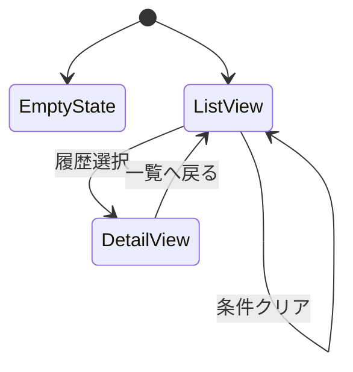
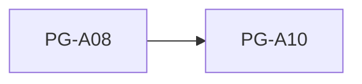

# PG-A08 AI判定履歴

---

# 1. 基本情報

| 項目           | 内容                          |
| -------------- | ----------------------------- |
| 図面番号       | PG-A08                        |
| 画面名称       | AI判定履歴                    |
| Screen Name    | EvaluationHistoryPage         |
| URL            | /evaluation-histories         |
| 利用者         | 管理者・職員                  |
| 共通レイアウト | CM-L01 管理画面共通レイアウト |

---

# 2. 画面概要

過去に実行したAI判定履歴を参照する。

AI判定時点の判定結果および判定根拠を監査目的で保存・閲覧する。

本画面は履歴参照専用画面であり、AI判定結果の編集は行わない。

---

# 3. 画面構成

## 3-1. ヘッダーエリア

| 項目         | 内容                       |
| ------------ | -------------------------- |
| 画面タイトル | AI判定履歴                 |
| 説明文       | 過去のAI判定結果を参照する |
| 表示情報     | 総履歴件数                 |

---

## 3-2. メインエリア

### 検索・絞り込みエリア

検索項目

```text
助成金名

AI適合性

AI推奨度

判定実行日
```

---

### AI判定履歴一覧

表示項目

```text
判定日時

助成金名

AI適合性

AI推奨度

判定結果要約
```

---

### AI判定履歴詳細

表示項目

```text
助成金名

助成元

AI適合性

AI推奨度

AI判定理由

追加確認事項

不足情報

判定日時
```

---

### スナップショット情報

保存時点の情報を表示する。

```text
判定時定款情報

判定時活動実績

判定時募集要項要約
```

---

### EmptyState

履歴が存在しない場合

```text
AI判定履歴はまだありません。
```

を表示する。

---

## 3-3. 右サイド情報パネル

| 項目     | 内容                                     |
| -------- | ---------------------------------------- |
| 初期表示 | ON                                       |
| 折り畳み | 可                                       |
| 表示内容 | AI判定履歴の説明、適合性説明、推奨度説明 |

---

# 4. 表示項目一覧

| 項目名             | 必須 | 内容                 |
| ------------------ | ---- | -------------------- |
| 判定日時           | ○    | AI判定実行日時       |
| 助成金名           | ○    | 判定対象助成金       |
| AI適合性           | ○    | 適合性判定           |
| AI推奨度           | ○    | 推奨ランク           |
| AI判定理由         | -    | 判定根拠             |
| 追加確認事項       | -    | 人間が確認すべき事項 |
| 不足情報           | -    | 未登録情報           |
| 判定時定款情報     | -    | スナップショット     |
| 判定時活動実績     | -    | スナップショット     |
| 判定時募集要項要約 | -    | スナップショット     |

---

# 5. 操作一覧

| 操作         | 動作           |
| ------------ | -------------- |
| 検索         | 条件で絞り込み |
| 条件クリア   | 検索条件初期化 |
| 履歴選択     | 詳細表示       |
| 案件詳細表示 | PG-A10へ遷移   |

---

# 6. 業務ルール

- AI判定履歴は監査ログとして扱う。
- AI判定履歴は更新しない。
- AI判定履歴は削除しない。
- AI判定結果はスナップショットとして保持する。
- AI判定時点の定款・活動実績・募集要項を保持する。
- AI判定履歴は案件状態変更の影響を受けない。

---

## 履歴保存方針

履歴は判定時点の情報を保存する。

そのため、

```text
定款変更

活動実績追加

助成金情報変更
```

が発生しても履歴内容は変化しない。

---

## 監査ログ方針

```text
更新禁止

削除禁止
```

とする。

---

# 7. 状態遷移



---

# 8. 他画面との関係



---

## 遷移ルール

履歴から対応する助成金案件を開くことができる。

AI判定履歴から案件状態を変更することはできない。

---

# 9. バリデーション・セキュリティガード

本画面は参照専用画面である。

登録・更新用の入力バリデーションは行わない。

---

## スナップショット表示ルール

履歴詳細で表示する情報は判定実行時点の保存データである。

表示文

```text
本情報はAI判定実行時点の保存データです。

現在の登録内容とは異なる場合があります。
```

---

## セキュリティガード

AI判定理由や追加確認事項には個人情報を含めない。

---

# 10. MVP実装範囲

```text
履歴一覧表示

履歴詳細表示

検索

絞り込み

条件クリア

スナップショット表示

案件詳細遷移

EmptyState
```

---

# 11. 将来拡張

```text
判定理由全文検索

履歴比較

採択分析

不採択分析

RAG検索

ローカルLLM

AIモデル比較

履歴エクスポート

監査レポート出力
```

---

# 12. 実装メモ

```text
EvaluationHistoryは監査ログとして扱う。

更新しない。

削除しない。

履歴は判定時点のスナップショットを保持する。

案件状態変更の影響を受けない。

PG-A10との関連付けはgrantCaseIdを利用する。
```
