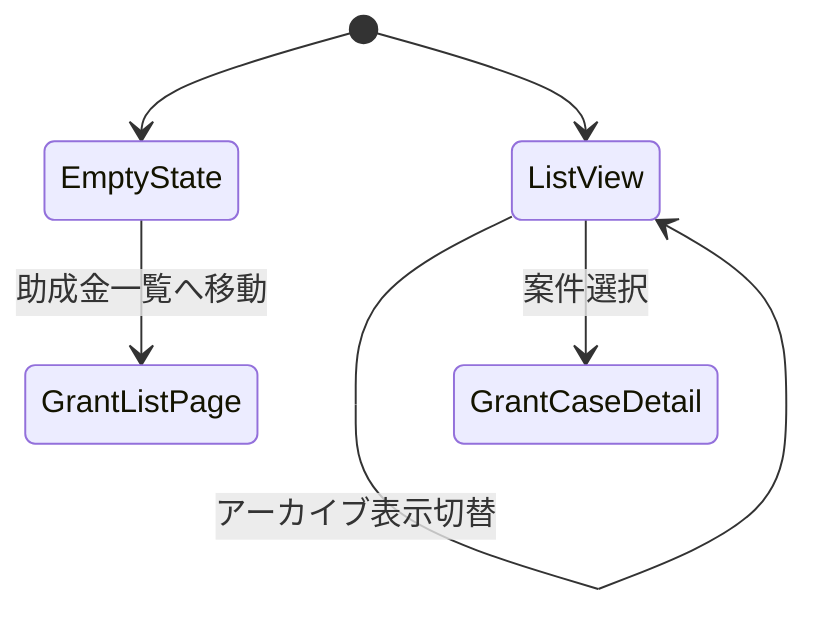
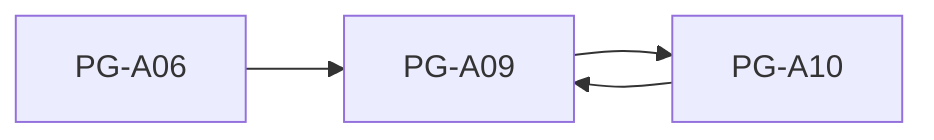

# PG-A09 助成金案件一覧

---

# 1. 基本情報

| 項目           | 内容                          |
| -------------- | ----------------------------- |
| 図面番号       | PG-A09                        |
| 画面名称       | 助成金案件一覧                |
| Screen Name    | GrantCaseListPage             |
| URL            | /grant-cases                  |
| 利用者         | 管理者・職員                  |
| 共通レイアウト | CM-L01 管理画面共通レイアウト |

---

# 2. 画面概要

AI判定によって作成された助成金案件を一覧で管理する。

案件の検討状況、外部審査結果、AI判定結果、推奨度、締切状態を確認し、必要に応じて PG-A10 助成金案件詳細へ遷移する。

本画面は助成金案件管理の入口となる画面である。

---

# 3. 画面構成

## 3-1. ヘッダーエリア

| 項目         | 内容                                               |
| ------------ | -------------------------------------------------- |
| 画面タイトル | 助成金案件一覧                                     |
| 説明文       | AI判定によって作成された助成金案件を確認・管理する |
| 表示情報     | 案件件数、未確認件数、検討中件数、締切間近件数     |

---

## 3-2. メインエリア

### 検索・絞り込みエリア

検索項目

```text
助成金名

助成元

キーワード
```

絞り込み項目

```text
検討状況

外部審査結果

AI適合性

AI推奨度

締切状態

アーカイブ状態
```

---

### 助成金案件一覧テーブル

表示項目

```text
助成金名

助成元

募集締切

締切状態

AI適合性

AI推奨度

検討状況

外部審査結果

案件作成日

最終更新日
```

---

### アーカイブ表示

初期値

```text
アーカイブ案件を表示しない
```

選択肢

```text
表示しない

表示する
```

---

### EmptyState

助成金案件が存在しない場合

```text
助成金案件はまだ作成されていません。
```

を表示する。

補足文

```text
助成金一覧からAI判定を実行すると、助成金案件が作成されます。
```

表示ボタン

```text
助成金一覧へ移動
```

遷移先

```text
PG-A06 助成金一覧
```

---

## 3-3. 右サイド情報パネル

| 項目     | 内容                                                       |
| -------- | ---------------------------------------------------------- |
| 初期表示 | ON                                                         |
| 折り畳み | 可                                                         |
| 表示内容 | 案件件数サマリー、検討状況説明、AI適合性説明、AI推奨度説明 |

---

# 4. 表示項目一覧

| 項目名       | 必須 | 内容                     |
| ------------ | ---- | ------------------------ |
| 助成金名     | ○    | 対象助成金               |
| 助成元       | ○    | 助成金提供団体           |
| 募集締切     | ○    | 応募締切日               |
| 締切状態     | ○    | 通常・締切間近・期限切れ |
| AI適合性     | ○    | 最新AI判定結果           |
| AI推奨度     | ○    | 最新推奨ランク           |
| 検討状況     | ○    | 現在状態                 |
| 外部審査結果 | ○    | 現在状態                 |
| 案件作成日   | ○    | 案件生成日時             |
| 最終更新日   | ○    | 更新日時                 |

---

# 5. 操作一覧

| 操作               | 動作                 |
| ------------------ | -------------------- |
| 検索               | 条件で絞り込む       |
| 条件クリア         | 検索条件初期化       |
| 案件詳細表示       | PG-A10へ遷移         |
| 助成金一覧へ移動   | PG-A06へ遷移         |
| アーカイブ表示切替 | 表示有無を切り替える |

---

# 6. 業務ルール

- 本画面は GrantCase の現在状態を一覧表示する。
- AI適合性とAI推奨度は最新の EvaluationHistory を利用する。
- GrantCase は現在状態を保持する。
- EvaluationHistory はAI判定時点の履歴を保持する。
- 物理削除は行わない。
- 不要案件は PG-A10 でアーカイブする。
- アーカイブ済み案件は初期表示では非表示とする。
- 締切状態はバックエンド側で算出する。
- AI判定結果は参考情報であり、最終判断は利用者が行う。

---

## GrantCase と EvaluationHistory の役割分離

```text
GrantCase
↓
現在状態

EvaluationHistory
↓
過去履歴
```

として管理する。

---

## アーカイブ方針

不要案件は削除せずアーカイブで管理する。

---

# 7. 状態遷移



---

# 8. 他画面との関係



---

## 遷移ルール

PG-A10から戻った場合は一覧条件を復元する。

---

# 9. バリデーション・セキュリティガード

本画面は一覧参照画面である。

登録・更新用の入力バリデーションは行わない。

---

## AI判定結果表示

表示文

```text
AI判定結果は参考情報です。

応募可否の最終判断は利用者が行います。
```

---

## セキュリティガード

案件一覧には利用者個人情報を表示しない。

---

# 10. MVP実装範囲

```text
案件一覧表示

検索

絞り込み

条件クリア

AI適合性表示

AI推奨度表示

検討状況表示

外部審査結果表示

アーカイブ表示切替

案件詳細遷移

EmptyState
```

---

# 11. 将来拡張

```text
案件ステージ管理

採択率分析

不採択分析

RAG検索

ローカルLLM

助成金ライフサイクル管理

締切自動通知

進捗ダッシュボード

案件優先順位自動提案
```

---

## 将来の案件ステージ

```text
募集中

申請準備中

申請済

審査中

採択

事業実施中

報告・精算

完了
```

---

# 12. 実装メモ

```text
GrantCaseは現在状態を保持する。

EvaluationHistoryは過去履歴を保持する。

物理削除は行わない。

不要案件はアーカイブで管理する。

PG-A10から戻った場合は一覧条件を復元する。

AI判定結果は最新履歴を利用する。
```
