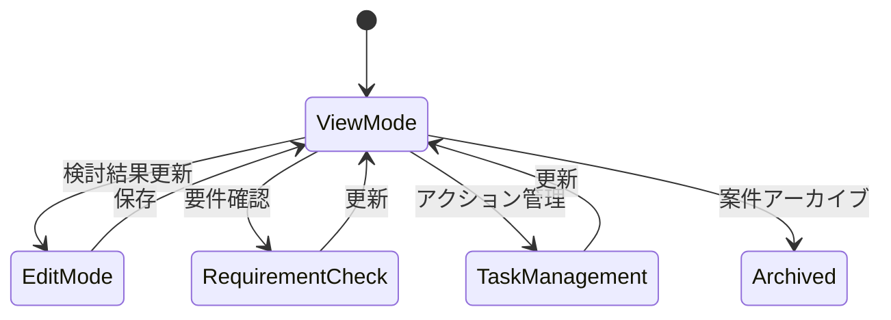
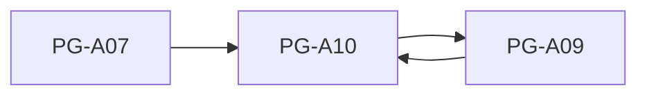

# PG-A10 助成金案件詳細

---

# 1. 基本情報

| 項目           | 内容                          |
| -------------- | ----------------------------- |
| 図面番号       | PG-A10                        |
| 画面名称       | 助成金案件詳細                |
| Screen Name    | GrantCaseDetailPage           |
| URL            | /grant-cases/:grantCaseId     |
| 利用者         | 管理者・職員                  |
| 共通レイアウト | CM-L01 管理画面共通レイアウト |

---

# 2. 画面概要

AI判定によって作成された助成金案件について、

- 案件の現在状態
- AI判定結果
- 応募要件確認
- 次のアクション

を管理する。

本画面は助成金案件管理の中心画面である。

---

# 3. 画面構成

## 3-1. ヘッダーエリア

| 項目         | 内容                       |
| ------------ | -------------------------- |
| 画面タイトル | 助成金案件詳細             |
| 表示情報     | 助成金名、助成元、募集年度 |
| 状態表示     | 検討状況、外部審査結果     |
| 操作         | 一覧へ戻る、案件アーカイブ |

---

## 3-2. メインエリア

### 基本情報エリア

表示項目

```text
助成金名

助成元

募集期間

募集締切

助成上限額

公式URL

案件作成日

最終更新日
```

---

### AI判定結果エリア

表示項目

```text
AI適合性

AI推奨度

AI判定理由

AI判定日時
```

AI適合性

```text
適合

要確認

不適合
```

AI推奨度

```text
A

B

C
```

---

### 判定根拠エリア

表示項目

```text
判定時定款情報

判定時活動実績

判定時募集要項要約
```

役割

```text
AI判定時点の根拠情報を確認する
```

---

### 応募要件確認エリア

表示項目

```text
要件名

確認状況

対象資料
```

確認状況

```text
未確認

確認中

確認済

不要
```

---

### 次のアクションエリア

表示項目

```text
タスク内容

期限

完了状態
```

主な操作

```text
追加

更新

完了

アーカイブ
```

---

### 検討結果エリア

入力項目

```text
検討状況

外部審査結果

検討メモ
```

検討状況

```text
未確認

検討中

見送り
```

外部審査結果

```text
結果未通知

審査中

採択

不採択
```

---

### PDFプレビューエリア

表示項目

```text
PDFプレビュー

対象ファイル名
```

未選択時

```text
対象PDFを選択してください。
```

---

## 3-3. 右サイド情報パネル

| 項目     | 内容                                                 |
| -------- | ---------------------------------------------------- |
| 初期表示 | ON                                                   |
| 折り畳み | 可                                                   |
| 表示内容 | AI判定日時、案件作成日時、最終更新日時、利用上の注意 |

---

# 4. 表示項目一覧

| 項目名         | 必須 | 内容           |
| -------------- | ---- | -------------- |
| 助成金名       | ○    | 案件対象助成金 |
| AI適合性       | ○    | 最新AI判定結果 |
| AI推奨度       | ○    | 最新AI推奨度   |
| AI判定理由     | -    | AI判定根拠     |
| 応募要件確認   | -    | 要件確認状況   |
| 次のアクション | -    | 実務タスク     |
| 検討状況       | ○    | 現在状態       |
| 外部審査結果   | ○    | 現在状態       |
| 検討メモ       | -    | 利用者記録     |

---

# 5. 操作一覧

| 操作                 | 動作                   |
| -------------------- | ---------------------- |
| 検討結果保存         | 現在状態を更新する     |
| 案件アーカイブ       | 通常一覧から除外する   |
| 要件確認更新         | 要件確認状態を更新する |
| アクション追加       | タスクを追加する       |
| アクション更新       | タスクを更新する       |
| アクション完了       | 完了状態に変更する     |
| アクションアーカイブ | タスクを非表示にする   |
| PDFプレビュー        | 対象資料を表示する     |
| 一覧へ戻る           | PG-A09へ戻る           |

---

# 6. 業務ルール

## GrantCaseの責務

現在状態を管理する。

```text
検討状況

外部審査結果

検討メモ

アーカイブ状態
```

---

## EvaluationHistoryの責務

AI判定時点の履歴を管理する。

```text
AI判定結果

AI推奨度

AI判定理由

判定根拠

AI判定日時
```

---

## GrantRequirementsCheckの責務

応募要件の確認状況を管理する。

---

## NextActionの責務

応募要件確認に紐づく実務タスクを管理する。

---

## AIの位置付け

AIは最終判断を行わない。

応募可否は利用者が決定する。

---

## 削除方針

物理削除は行わない。

不要データはアーカイブ管理とする。

---

# 7. 状態遷移



---

# 8. 他画面との関係



---

## 戻り先ルール

PG-A09へ戻る場合は一覧条件を復元する。

---

# 9. バリデーション・セキュリティガード

## 見送り時

条件

```text
検討状況 = 見送り
```

必須

```text
検討メモ
```

未入力時

```text
見送り理由を入力してください。
```

---

## アーカイブ時

必須

```text
アーカイブ理由
```

---

## 外部審査結果変更ガード

審査中へ変更する場合、

```text
確認済

対象資料あり
```

の応募要件が1件以上必要とする。

条件未達成時

```text
応募要件確認が完了していません。
```

を表示する。

---

## セキュリティガード

自由入力欄では以下を表示する。

```text
個人情報や機微情報を入力しないでください。

利用者氏名

住所

連絡先

相談内容

医療情報

障害情報

支援記録

などの記載は禁止します。
```

目的

```text
プライバシー保護

AI利用時の安全性確保

将来のRAG検索時の情報漏洩防止
```

---

# 10. MVP実装範囲

```text
案件詳細表示

AI判定結果表示

判定根拠表示

応募要件確認

次のアクション管理

検討結果保存

案件アーカイブ

PDFプレビュー

アーカイブ理由管理

一覧条件復元
```

---

# 11. 将来拡張

```text
PDFアップロード

OCR

RAG検索

ローカルLLM

案件ステージ管理

申請書管理

交付申請管理

中間報告管理

実績報告管理

精算管理
```

---

## 将来のライフサイクル

```text
募集中

申請準備中

申請済

審査中

採択

事業実施中

報告・精算

完了
```

---

# 12. 実装メモ

```text
GrantCaseは現在状態を保持する。

EvaluationHistoryは過去履歴を保持する。

GrantRequirementsCheckは応募要件確認を管理する。

NextActionは実務タスクを管理する。

物理削除は行わない。

不要データはアーカイブ管理とする。

AIは最終判断を行わない。
```
