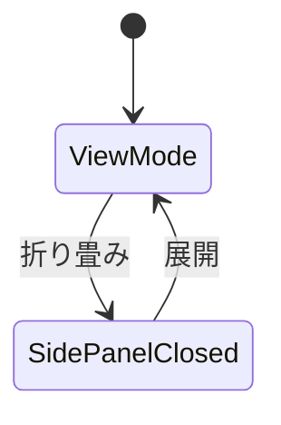
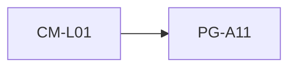

# PG-A11 設定

---

# 1. 基本情報

| 項目           | 内容                          |
| -------------- | ----------------------------- |
| 図面番号       | PG-A11                        |
| 画面名称       | 設定                          |
| Screen Name    | SettingPage                   |
| URL            | /settings                     |
| 利用者         | 管理者・職員                  |
| 共通レイアウト | CM-L01 管理画面共通レイアウト |

---

# 2. 画面概要

システム情報を確認する。

MVPでは設定変更機能を提供しない。

本画面はシステム情報および開発状況を確認するための参照専用画面として利用する。

---

# 3. 画面構成

## 3-1. ヘッダーエリア

| 項目         | 内容                   |
| ------------ | ---------------------- |
| 画面タイトル | 設定                   |
| 説明文       | システム情報を確認する |

---

## 3-2. メインエリア

### システム情報エリア

表示項目

```text
システム名

システムバージョン

リリース日

開発状況
```

---

### MVP実装状況エリア

表示項目

```text
団体基本情報管理

定款条文管理

活動実績管理

助成金一覧

AI判定

案件管理
```

---

## 3-3. 右サイド情報パネル

| 項目     | 内容                                |
| -------- | ----------------------------------- |
| 初期表示 | ON                                  |
| 折り畳み | 可                                  |
| 表示内容 | システム説明、MVP方針、将来拡張方針 |

---

# 4. 表示項目一覧

| 項目名             | 必須 | 内容             |
| ------------------ | ---- | ---------------- |
| システム名         | ○    | システム名称     |
| システムバージョン | ○    | 現在バージョン   |
| リリース日         | -    | MVPリリース日    |
| 開発状況           | ○    | MVP・開発中など  |
| MVP実装状況        | -    | 実装済み機能一覧 |
| 将来実装予定       | -    | 今後の拡張予定   |

---

# 5. 操作一覧

| 操作               | 動作             |
| ------------------ | ---------------- |
| 右サイドパネル開閉 | 補足情報表示切替 |
|                    |                  |

---

# 6. 状態遷移



---

# 7. 他画面との関係



---

## 遷移ルール

左サイドメニューから遷移する。

MVPでは本画面から他画面への専用遷移は持たない。

---

# 8. バリデーション・セキュリティガード

本画面は参照専用画面である。

入力バリデーションは行わない。

---

## セキュリティガード

設定変更機能を提供しないため、権限制御対象外とする。

---
