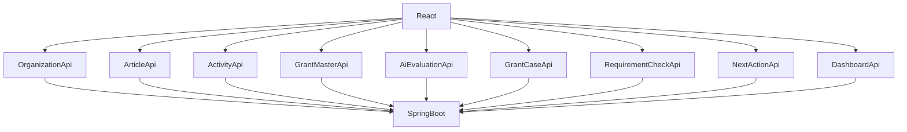

# API設計書

---

# 1. API設計方針

## 1-1. 目的

本APIは、

- 団体情報管理
- 定款管理
- 活動実績管理
- 助成金管理
- AI判定
- 案件管理

を実現するためのバックエンドAPI群である。

フロントエンドは React + TypeScript、

バックエンドは Spring Boot + MyBatis + MySQL を採用する。

---

## 1-2. 設計原則

各APIは責務ごとに分離する。

```text
Organization
↓
団体情報

Article
↓
定款

Activity
↓
活動実績

GrantMaster
↓
助成金マスター

GrantCase
↓
案件

EvaluationHistory
↓
監査履歴

GrantRequirementsCheck
↓
応募要件確認

NextAction
↓
実務タスク
```

責務を混在させない。

---

## 1-3. REST方針

取得

```text
GET
```

登録

```text
POST
```

更新

```text
PUT
```

削除

```text
DELETE
```

を利用する。

---

# 2. ステータス定義

---

## 検討状況

```text
UNCONFIRMED
未確認

UNDER_REVIEW
検討中

SKIPPED
見送り
```

---

## 外部審査結果

```text
NO_RESPONSE
結果未通知

UNDER_AUDIT
審査中

ADOPTED
採択

REJECTED
不採択
```

---

## 応募要件確認

```text
UNCHECKED
未確認

CHECKING
確認中

COMPLETED
確認済

NOT_REQUIRED
不要
```

---

## AI適合性

```text
SUITABLE
適合

NEEDS_CONFIRMATION
要確認

UNSUITABLE
不適合
```

---

## AI推奨度

```text
A

B

C
```

---

## 締切状態

```text
NORMAL

NEAR_DEADLINE

EXPIRED
```

---

# 3. API全体構成



---

# 4. organization_profiles API

役割

```text
団体基本情報管理
```

利用画面

```text
PG-A03
```

---

### GET

```text
GET /api/organization-profiles
```

団体情報取得

---

### PUT

```text
PUT /api/organization-profiles
```

団体情報更新

---

### 責務

```text
団体名

住所

連絡先

団体概要

活動目的
```

のみを管理する。

---

# 5. charter_articles API

役割

```text
定款条文管理
```

利用画面

```text
PG-A04
```

---

### GET

```text
GET /api/charter-articles
```

一覧取得

---

### POST

```text
POST /api/charter-articles
```

登録

---

### PUT

```text
PUT /api/charter-articles/{id}
```

更新

---

### DELETE

```text
DELETE /api/charter-articles/{id}
```

削除

---

### 責務

```text
条番号

タイトル

条文本文
```

を管理する。

---

# 6. activity_records API

役割

```text
活動実績管理
```

利用画面

```text
PG-A05
```

---

### GET

```text
GET /api/activity-records
```

一覧取得

---

### POST

```text
POST /api/activity-records
```

登録

---

### PUT

```text
PUT /api/activity-records/{id}
```

更新

---

### DELETE

```text
DELETE /api/activity-records/{id}
```

削除

---

### 責務

```text
実施年度

事業名

活動内容

成果

添付資料情報
```

を管理する。

---

# 7. grant_masters API

役割

```text
助成金マスター管理
```

利用画面

```text
PG-A06

PG-A06B

PG-A07

PG-A10
```

---

### GET

```text
GET /api/grant-masters
```

助成金一覧取得

---

### GET

```text
GET /api/grant-masters/{id}
```

助成金詳細取得

---

### POST

```text
POST /api/grant-masters
```

助成金登録

---

### PUT

```text
PUT /api/grant-masters/{id}
```

助成金更新

---

### PATCH

```text
PATCH /api/grant-masters/{id}/archive
```

助成金アーカイブ

---

### 責務

```text
募集年度

助成金名

助成元

募集開始日

募集締切日

助成上限額

募集要項要約

公開状態

アーカイブ状態
```

を管理する。

---

### 方針

助成金マスターは年度ごとに別レコードとして管理する。

物理削除は行わない。

不要になった助成金マスターはアーカイブで管理する。

---

# 8. grant_cases API

役割

```text
助成金案件管理
```

利用画面

```text
PG-A09

PG-A10
```

---

### GET

```text
GET /api/grant-cases
```

助成金案件一覧取得

---

### GET

```text
GET /api/grant-cases/{id}
```

助成金案件詳細取得

---

### PUT

```text
PUT /api/grant-cases/{id}
```

助成金案件更新

---

### PATCH

```text
PATCH /api/grant-cases/{id}/archive
```

助成金案件アーカイブ

---

### 責務

```text
案件名

検討状況

外部審査結果

検討メモ

アーカイブ状態
```

を管理する。

---

### 方針

GrantCase は現在状態を保持する。

物理削除は行わない。

不要案件はアーカイブで管理する。

AI判定履歴は GrantCase ではなく EvaluationHistory が保持する。

---

# 9. ai-evaluations API

役割

```text
AI判定実行
```

利用画面

```text
PG-A07
```

---

### POST

```text
POST /api/ai-evaluations
```

AI判定を実行する。

---

### Request

```json
{
  "organizationId": 1,
  "grantMasterId": 101
}
```

---

### Response

```json
{
  "grantCaseId": 1,
  "aiSuitability": "SUITABLE",
  "aiRecommendationLevel": "A",
  "aiReason": "定款の目的と活動実績が助成対象事業と一致している。",
  "aiEvidence": "活動実績、定款条文、助成金募集要項を根拠として判定。"
}
```

---

### AI判定成功時

以下を生成する。

```text
GrantCase

EvaluationHistory

GrantRequirementsCheck
```

---

### 遷移方針

AI判定成功後は PG-A10 助成金案件詳細へ遷移する。

PG-A09 は経由しない。

---

### 方針

AIは最終判断を行わない。

AI判定結果は利用者の検討材料として扱う。

---

# 10. evaluation_histories API

役割

```text
AI判定履歴管理
```

利用画面

```text
PG-A08

PG-A08B

PG-A10
```

---

### GET

```text
GET /api/evaluation-histories
```

AI判定履歴一覧取得

---

### GET

```text
GET /api/evaluation-histories/{id}
```

AI判定履歴詳細取得

---

### GET

```text
GET /api/grant-cases/{grantCaseId}/evaluation-histories
```

案件に紐づくAI判定履歴取得

---

### 責務

```text
AI適合性

AI推奨度

AI判定理由

判定根拠

追加確認事項

不足情報

判定時点スナップショット

判定日時
```

を保持する。

---

### 方針

EvaluationHistory は監査ログとして扱う。

更新しない。

削除しない。

アーカイブしない。

---

# 11. grant_requirements_checks API

役割

```text
応募要件確認管理
```

利用画面

```text
PG-A10
```

---

### GET

```text
GET /api/grant-cases/{grantCaseId}/requirements-checks
```

応募要件確認一覧取得

---

### PUT

```text
PUT /api/requirements-checks/{id}
```

応募要件確認更新

---

### PATCH

```text
PATCH /api/requirements-checks/{id}/archive
```

応募要件確認アーカイブ

---

### Request

```json
{
  "checkStatus": "COMPLETED",
  "targetFileName": "2026_saori_business_plan.pdf",
  "checkMemo": "対象資料を確認済み。"
}
```

---

### 責務

```text
要件名

確認状況

対象資料

確認メモ

アーカイブ状態
```

を管理する。

---

### バリデーション

確認状況を確認済にする場合、対象資料を必須とする。

---

### 方針

GrantRequirementsCheck は応募要件確認状態を管理する。

AI判定履歴とは分離する。

---

# 12. next_actions API

役割

```text
次のアクション管理
```

利用画面

```text
PG-A10
```

---

### GET

```text
GET /api/requirements-checks/{requirementCheckId}/next-actions
```

次のアクション一覧取得

---

### POST

```text
POST /api/next-actions
```

次のアクション作成

---

### PUT

```text
PUT /api/next-actions/{id}
```

次のアクション更新

---

### PATCH

```text
PATCH /api/next-actions/{id}/archive
```

次のアクションアーカイブ

---

### Request

```json
{
  "requirementCheckId": 1,
  "actionTitle": "収支予算書を作成する",
  "dueDate": "2026-06-10"
}
```

---

### 責務

```text
タスク内容

期限

完了状態

アーカイブ状態
```

を管理する。

---

### 方針

NextAction は GrantRequirementsCheck に紐づく実務タスクとして扱う。

GrantCase の現在状態とは分離する。

---

# 13. dashboard API

役割

```text
ダッシュボード表示
```

利用画面

```text
PG-A02
```

---

### GET

```text
GET /api/dashboard/summary
```

サマリー取得

---

取得内容

```text
助成金案件数

未確認案件数

検討中案件数

締切間近件数

採択件数

不採択件数
```

---

### GET

```text
GET /api/dashboard/deadline-cases
```

締切間近案件取得

---

### GET

```text
GET /api/dashboard/under-review-cases
```

検討中案件取得

---

### GET

```text
GET /api/dashboard/unconfirmed-cases
```

未確認案件取得

---

### GET

```text
GET /api/dashboard/organization-status
```

組織情報登録状況取得

---

### GET

```text
GET /api/dashboard/recent-evaluations
```

最近のAI判定取得

---

### 方針

Dashboard API は集計・参照専用とする。

データ更新は行わない。
