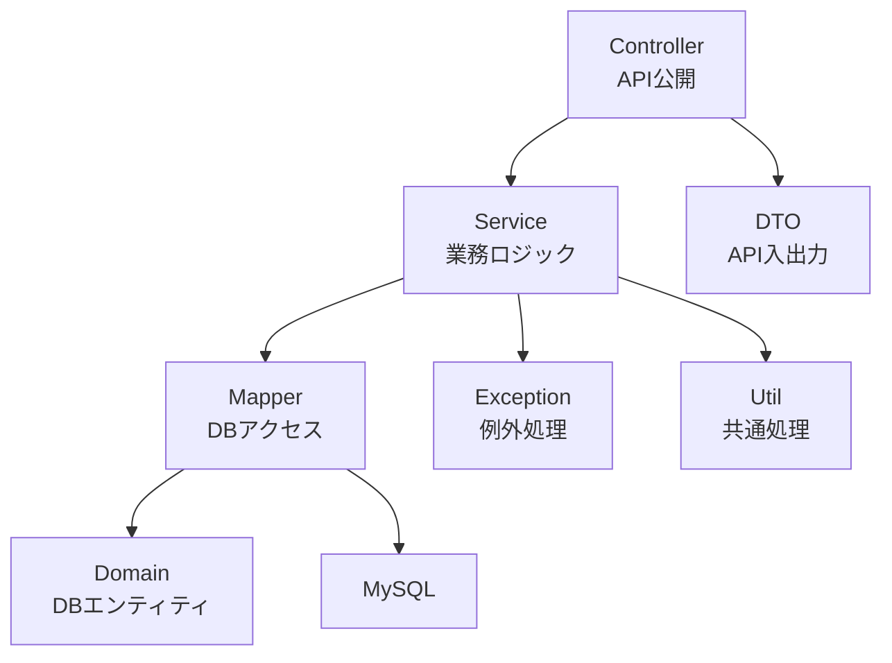
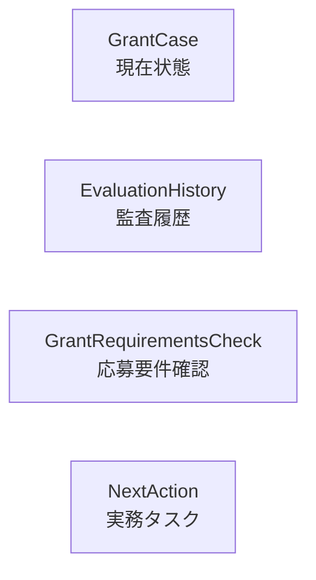
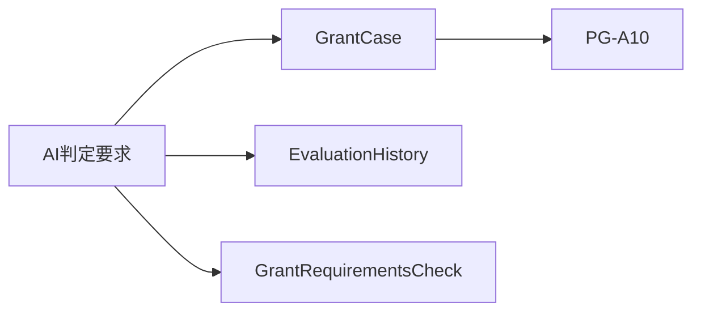
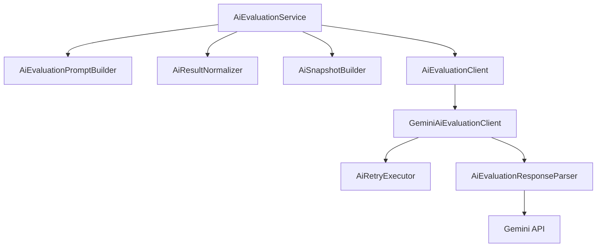

# バックエンド構成設計書

---

# 1. 目的

本書は、NPO運営AIマネージャーの Spring Boot バックエンド構成を定義する。

本システムでは以下を採用する。

```text
Spring Boot

MyBatis

MySQL
```

バックエンドは、React フロントエンドから呼び出される REST API を提供し、助成金案件管理、AI判定、監査履歴保存を担当する。

---

# 2. バックエンド全体構成



---

# 3. パッケージ構成

```text
com.saori.npo

├─ config
├─ controller
├─ service
├─ mapper
├─ domain
├─ dto
├─ exception
└─ util
```

---

## パッケージ責務

| パッケージ | 責務                       |
| ---------- | -------------------------- |
| config     | システム共通設定           |
| controller | REST API公開               |
| service    | 業務ロジック               |
| mapper     | MyBatis Mapper             |
| domain     | DBテーブル対応エンティティ |
| dto        | API入出力DTO               |
| exception  | 例外処理                   |
| util       | 共通ユーティリティ         |

---

# 4. config

## 役割

システム共通設定を管理する。

---

## 配置クラス

```text
CorsConfig

StorageConfig

MyBatisConfig
```

---

## CorsConfig

React フロントエンドとの通信を許可する。

MVPではローカル開発環境を対象とする。

---

## StorageConfig

ローカルPDF公開用設定を管理する。

Phase8以降の添付ファイル管理、PDF取込、Knowledge化を見据えて配置する。

---

## MyBatisConfig

MyBatisの共通設定を管理する。

対象

```text
MapperScan

TypeAlias

snake_case と camelCase の対応
```

---

# 5. domain

## 役割

DBテーブルと対応するエンティティを配置する。

Domain は APIレスポンス用ではなく、DB永続化のためのオブジェクトとして扱う。

---

## Domain一覧

```text
OrganizationProfile

CharterArticle

ActivityRecord

GrantMaster

GrantCase

EvaluationHistory

GrantRequirementsCheck

NextAction
```

---

## OrganizationProfile

対応

```text
organization_profiles
```

責務

```text
団体基本情報を保持する
```

主な項目

```text
団体名

法人種別

設立年月日

代表者名

住所

団体概要

活動目的
```

---

## CharterArticle

対応

```text
charter_articles
```

責務

```text
定款条文を保持する
```

主な項目

```text
条番号

条文タイトル

条文本文
```

---

## ActivityRecord

対応

```text
activity_records
```

責務

```text
活動実績を保持する
```

主な項目

```text
実施年度

事業名

活動内容

成果

添付資料ファイル名
```

---

## GrantMaster

対応

```text
grant_masters
```

責務

```text
助成金マスター情報を保持する
```

主な項目

```text
募集年度

助成金名

助成元

募集開始日

募集締切日

助成上限額

募集要項要約

募集テーマ

対象事業

対象団体

対象地域

提出書類

公式URL

アーカイブ状態
```

方針

```text
年度ごとに別レコードとして管理する。

物理削除は行わない。

不要な助成金マスターはアーカイブで管理する。
```

---

## GrantCase

対応

```text
grant_cases
```

責務

```text
助成金案件の現在状態を管理する
```

主な項目

```text
organizationId

grantMasterId

caseName

examinationStatus

externalAuditStatus

examinationMemo

isArchived

archivedAt

archiveReason
```

注意

```text
GrantCase は現在状態のみを保持する。

AI判定結果は保持しない。

AI判定結果は EvaluationHistory に保存する。

NextAction は GrantCase に直接紐づけない。
```

---

## EvaluationHistory

対応

```text
evaluation_histories
```

責務

```text
AI判定時点の履歴とスナップショットを管理する
```

主な項目

```text
grantCaseId

aiSuitability

aiRecommendationLevel

aiReason

aiEvidence

aiRawResponse

organizationSnapshot

charterSnapshot

activitySnapshot

grantSnapshot

evaluatedAt
```

方針

```text
監査ログとして扱う。

更新しない。

削除しない。

アーカイブしない。
```

---

## GrantRequirementsCheck

対応

```text
grant_requirements_checks
```

責務

```text
応募要件確認を管理する
```

主な項目

```text
grantCaseId

requirementName

checkStatus

targetFileName

checkMemo

isArchived
```

---

## NextAction

対応

```text
next_actions
```

責務

```text
応募要件確認に紐づく実務タスクを管理する
```

主な項目

```text
requirementCheckId

actionTitle

description

dueDate

completed

completedAt

isArchived

archiveReason
```

注意

```text
NextAction は GrantCase へ直接紐づけない。

GrantRequirementsCheck に紐づける。
```

---

# 6. mapper

## 役割

MyBatis Mapper を配置する。

Mapper はDBアクセスのみを担当し、業務判断を持たない。

---

## Mapper一覧

```text
OrganizationProfileMapper

CharterArticleMapper

ActivityRecordMapper

GrantMasterMapper

GrantCaseMapper

EvaluationHistoryMapper

GrantRequirementsCheckMapper

NextActionMapper
```

---

## MyBatis開発ルール

INSERTでは原則として以下を利用する。

```text
useGeneratedKeys="true"

keyProperty="id"
```

対象

```text
grant_cases

evaluation_histories

grant_requirements_checks

next_actions
```

---

## 削除・アーカイブ命名規律

物理削除を許容するMapperのみ delete 系メソッドを持つ。

---

### delete 許容

```text
CharterArticleMapper.deleteById()

ActivityRecordMapper.deleteById()
```

---

### archive 許容

```text
GrantMasterMapper.archiveById()

GrantCaseMapper.archiveById()

GrantRequirementsCheckMapper.archiveById()

NextActionMapper.archiveById()
```

---

### 更新・削除禁止

EvaluationHistoryMapper では更新・削除系メソッドを作成しない。

許可するメソッド例

```text
insert()

findAll()

findById()

findByGrantCaseId()

findLatestByGrantCaseId()
```

禁止するメソッド例

```text
update()

delete()

archive()
```

---

## 最新AI判定履歴取得

GrantCase に紐づく最新の EvaluationHistory を取得する。

取得条件

```text
grantCaseId
```

ソート方針

```text
判定日時の降順

IDの降順
```

取得件数

```text
1件
```

---

# 7. service

## 役割

Service は業務ロジックを担当する。

Controller から呼び出され、Mapper を利用してDB操作を行う。

Service には以下を集約する。

```text
業務ルール

入力チェック

重複チェック

状態変更

アーカイブ判定

AI判定時の生成処理
```

---

## Service一覧

```text
OrganizationProfileService

CharterArticleService

ActivityRecordService

GrantMasterService

GrantCaseService

AiEvaluationService

EvaluationHistoryService

GrantRequirementsCheckService

NextActionService

DashboardService
```

---

## OrganizationProfileService

責務

```text
団体基本情報取得

団体基本情報更新
```

利用画面

```text
PG-A03

PG-A07
```

---

## CharterArticleService

責務

```text
定款条文一覧取得

定款条文登録

定款条文更新

定款条文削除
```

業務ルール

```text
同一団体内で条番号の重複を禁止する。
```

---

## ActivityRecordService

責務

```text
活動実績一覧取得

活動実績登録

活動実績更新

活動実績削除
```

業務ルール

```text
同一団体内で同一年度・同一事業名の重複を禁止する。
```

---

## GrantMasterService

責務

```text
助成金マスター一覧取得

助成金マスター詳細取得

助成金マスター登録

助成金マスター更新

助成金マスターアーカイブ
```

業務ルール

```text
年度ごとに別レコードとして管理する。

物理削除は行わない。

不要な助成金マスターはアーカイブで管理する。
```

---

## GrantCaseService

責務

```text
助成金案件一覧取得

助成金案件詳細取得

助成金案件更新

助成金案件アーカイブ
```

業務ルール

```text
GrantCase は現在状態を保持する。

AI判定結果は保持しない。

物理削除は行わない。
```

---

### 見送り時のルール

検討状況を見送りにする場合、検討メモを必須とする。

---

### アーカイブ時のルール

案件をアーカイブする場合、アーカイブ理由を必須とする。

---

## AiEvaluationService

責務

```text
AI判定実行

AI判定結果保存

GrantCase生成

EvaluationHistory生成

GrantRequirementsCheck生成
```

---

### AI判定処理

AI判定実行時は以下を同一トランザクションで生成する。

```text
GrantCase

EvaluationHistory

GrantRequirementsCheck
```

---

### 失敗時

途中で失敗した場合は、すべてロールバックする。

---

### 方針

```text
AIは最終判断を行わない。

AI判定結果は検討材料として扱う。

AI判定後は PG-A10 へ遷移できるよう grantCaseId を返却する。
```

---

## EvaluationHistoryService

責務

```text
AI判定履歴一覧取得

AI判定履歴詳細取得

案件単位のAI判定履歴取得

最新AI判定履歴取得
```

業務ルール

```text
EvaluationHistory は監査ログとして扱う。

更新しない。

削除しない。

アーカイブしない。
```

---

## GrantRequirementsCheckService

責務

```text
応募要件一覧取得

応募要件更新

応募要件アーカイブ
```

業務ルール

```text
応募要件確認状態を管理する。

AI判定履歴とは分離する。
```

---

### 確認済みルール

確認状況を確認済みにする場合、対象資料を必須とする。

---

## NextActionService

責務

```text
次のアクション一覧取得

次のアクション登録

次のアクション更新

次のアクション完了

次のアクションアーカイブ
```

業務ルール

```text
NextAction は GrantRequirementsCheck に紐づける。

GrantCase へ直接紐づけない。

実務タスクとして管理する。
```

---

### 完了処理

未完了から完了へ変更された場合、完了日時を記録する。

---

### アーカイブ時のルール

アーカイブする場合、アーカイブ理由を必須とする。

---

## DashboardService

責務

```text
サマリー取得

締切間近案件取得

未確認案件取得

検討中案件取得

最近のAI判定取得

組織情報登録状況取得
```

方針

```text
参照専用とする。

データ更新は行わない。
```

---

# 8. controller

## 役割

Controller は REST API の入口を担当する。

Controller には業務ロジックを書かない。

Controller は以下のみを担当する。

```text
HTTPリクエスト受信

Request DTO受け取り

Service呼び出し

Response DTO返却
```

---

## Controller一覧

```text
OrganizationProfileController

CharterArticleController

ActivityRecordController

GrantMasterController

GrantCaseController

AiEvaluationController

EvaluationHistoryController

GrantRequirementsCheckController

NextActionController

DashboardController
```

---

## URL方針

共通プレフィックス

```text
/api
```

---

## Controller責務一覧

| Controller                       | 責務              |
| -------------------------------- | ----------------- |
| OrganizationProfileController    | 団体基本情報API   |
| CharterArticleController         | 定款条文API       |
| ActivityRecordController         | 活動実績API       |
| GrantMasterController            | 助成金マスターAPI |
| GrantCaseController              | 助成金案件API     |
| AiEvaluationController           | AI判定API         |
| EvaluationHistoryController      | AI判定履歴API     |
| GrantRequirementsCheckController | 応募要件確認API   |
| NextActionController             | 次のアクションAPI |
| DashboardController              | ダッシュボードAPI |

---

## Controller設計ルール

```text
Controller は薄く保つ。

業務判断は Service に置く。

DBアクセスは Mapper に直接行わない。

Domain を直接返す場合はMVPに限定する。

将来的には Response DTO を返す。
```

---

# 9. dto

## 役割

DTO は API 入出力専用オブジェクトである。

Domain と DTO は責務を分離する。

---

## DTO方針

```text
Request DTO
↓
フロントエンドから受け取る入力

Response DTO
↓
フロントエンドへ返す出力
```

---

## 主なDTO

```text
OrganizationProfileRequest

OrganizationProfileResponse

CharterArticleRequest

CharterArticleResponse

ActivityRecordRequest

ActivityRecordResponse

GrantMasterRequest

GrantMasterResponse

GrantCaseUpdateRequest

GrantCaseResponse

AiEvaluationRequest

AiEvaluationResponse

EvaluationHistoryResponse

RequirementCheckUpdateRequest

RequirementCheckResponse

NextActionRequest

NextActionResponse

DashboardSummaryResponse
```

---

## GrantCaseResponse

主な項目

```text
id

caseName

grantName

grantProvider

deadline

deadlineStatus

examinationStatus

externalAuditStatus

examinationMemo

isArchived
```

---

## AiEvaluationResponse

AI判定直後に返却する。

主な項目

```text
grantCaseId

evaluationHistoryId

aiSuitability

aiRecommendationLevel

aiReason

aiEvidence
```

---

## EvaluationHistoryResponse

主な項目

```text
id

grantCaseId

grantName

aiSuitability

aiRecommendationLevel

aiReason

aiEvidence

evaluatedAt
```

---

## RequirementCheckResponse

主な項目

```text
id

requirementName

checkStatus

targetFileName

checkMemo

isArchived
```

---

## NextActionResponse

主な項目

```text
id

actionTitle

description

dueDate

completed

completedAt

isArchived
```

---

## DashboardSummaryResponse

主な項目

```text
grantCaseCount

unconfirmedCount

underReviewCount

nearDeadlineCount

adoptedCount

rejectedCount
```

---

# 10. exception

## 役割

システム全体の例外を統一管理する。

---

## Exception一覧

```text
BusinessException

ValidationException

NotFoundException

AiEvaluationException
```

---

## BusinessException

業務ルール違反時に利用する。

例

```text
条番号重複

活動実績重複

見送り理由未入力

アーカイブ理由未入力

応募要件確認未完了
```

---

## ValidationException

入力値検証エラー時に利用する。

例

```text
必須未入力

文字数超過

形式不正
```

---

## NotFoundException

対象データが存在しない場合に利用する。

例

```text
GrantCase 不存在

GrantMaster 不存在

ActivityRecord 不存在

RequirementCheck 不存在
```

---

## AiEvaluationException

AI判定失敗時に利用する。

例

```text
AI接続失敗

レスポンス解析失敗

タイムアウト

API制限

想定外レスポンス
```

---

## 例外レスポンス方針

フロントエンドが表示しやすい形式で返却する。

```text
message

errorCode

details
```

---

## 共通例外処理

将来的には ControllerAdvice による共通例外ハンドリングを行う。

MVPでは必要に応じて段階的に整備する。

---

# 11. 状態管理方針

状態管理は責務ごとに分離する。

---

## GrantCase

現在状態を管理する。

対象

```text
検討状況

外部審査結果

検討メモ

アーカイブ状態
```

---

## EvaluationHistory

AI判定時点の履歴を管理する。

対象

```text
AI適合性

AI推奨度

判定理由

判定根拠

スナップショット

判定日時
```

---

## GrantRequirementsCheck

応募要件確認状態を管理する。

対象

```text
要件名

確認状況

対象資料

確認メモ
```

---

## NextAction

実務タスクを管理する。

対象

```text
タスク内容

期限

完了状態

完了日時
```

---

# 12. 現在状態と履歴の分離



---

## 原則

```text
現在状態と履歴を混在させない。

履歴は現在状態変更の影響を受けない。

AI判定結果は GrantCase に保持しない。
```

---

# 13. 削除・アーカイブ方針

---

## 物理削除を許可する

対象

```text
CharterArticle

ActivityRecord
```

理由

```text
入力ミス修正

重複登録修正
```

---

## アーカイブ管理

対象

```text
GrantMaster

GrantCase

GrantRequirementsCheck

NextAction
```

理由

```text
トレーサビリティ確保

履歴保全
```

---

## 更新・削除禁止

対象

```text
EvaluationHistory
```

理由

```text
監査ログ保護
```

---

# 14. AI判定トランザクション

AI判定は単一トランザクションで処理する。

---

## AI判定成功時



---

生成対象

```text
GrantCase

EvaluationHistory

GrantRequirementsCheck
```

---

## ロールバック方針

途中で失敗した場合、

```text
GrantCase

EvaluationHistory

GrantRequirementsCheck
```

をすべてロールバックする。

不完全なデータは残さない。

---

# 15. AIアーキテクチャ



---

## 責務

### AiEvaluationService

```text
AI判定全体制御
```

---

### AiEvaluationPromptBuilder

```text
プロンプト生成
```

---

### AiResultNormalizer

```text
AI結果正規化
```

---

### AiSnapshotBuilder

```text
スナップショット生成
```

---

### AiEvaluationClient

```text
AIプロバイダ抽象化
```

---

### GeminiAiEvaluationClient

```text
Gemini連携
```

---

### AiRetryExecutor

```text
リトライ制御
```

---

### AiEvaluationResponseParser

```text
レスポンス解析
```

---

# 16. Phase8拡張予約

追加予定パッケージ

```text
storage

document

knowledge

rag

provider
```

---

## storage

役割

```text
添付ファイル管理
```

対象

```text
PDF

Word

Excel

画像
```

---

## document

役割

```text
文書管理
```

対象

```text
活動報告書

事業計画書

決算書

議事録
```

---

## knowledge

役割

```text
組織知識管理
```

---

## rag

役割

```text
RAG検索
```

---

## provider

役割

```text
AIプロバイダ管理
```

対象

```text
Gemini

OpenAI

Claude

ローカルLLM
```
