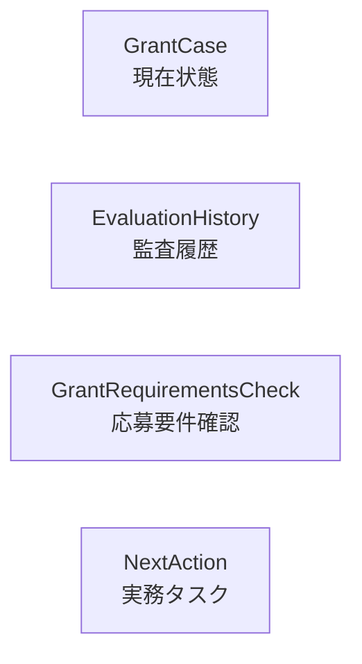
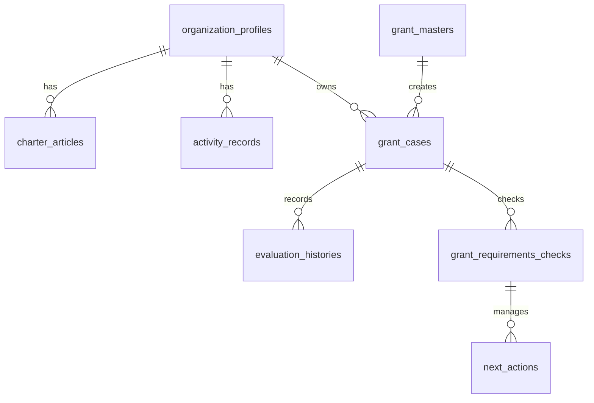
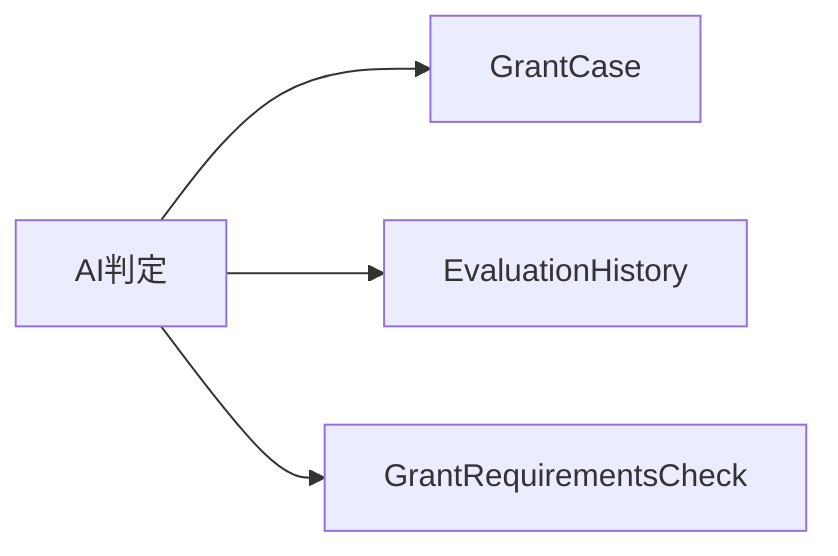

# データベース設計書

---

# 1. 目的

本書は、NPO運営AIマネージャーのデータベース構造を定義する。

本システムは、NPO運営における以下の情報を管理する。

```text
団体情報

定款条文

活動実績

助成金情報

AI判定履歴

助成金案件

応募要件確認

次のアクション
```

AIは最終判断を行わない。

AIは判断材料を提示し、最終判断は利用者が行う。

その判断過程をデータとして保存することで、説明可能性とトレーサビリティを確保する。

---

# 2. DB設計方針

## 2-1. 現在状態と履歴を分離する



---

## 2-2. 責務を混在させない

```text
GrantCase
↓
現在状態

EvaluationHistory
↓
AI判定履歴

GrantRequirementsCheck
↓
応募要件確認

NextAction
↓
実務タスク
```

---

## 2-3. 物理削除を最小化する

物理削除を許可するのは以下のみとする。

```text
charter_articles

activity_records
```

それ以外は原則としてアーカイブ管理または更新・削除禁止とする。

---

## 2-4. スナップショットを保存する

AI判定時点の情報は、後から元データが変更されても追跡できるようにスナップショットとして保存する。

保存対象

```text
団体情報

定款情報

活動実績

助成金情報

AI判定結果

AI生レスポンス
```

---

## 2-5. MySQL物理設計ルール

全テーブルは以下の物理設計ルールに従う。

```sql
ENGINE=InnoDB
DEFAULT CHARSET=utf8mb4
COLLATE=utf8mb4_0900_ai_ci
```

---

## 2-6. 主キー自動採番ルール

原則として各テーブルの主キーは以下とする。

```sql
id BIGINT PRIMARY KEY AUTO_INCREMENT
```

---

# 3. テーブル一覧

| テーブル名                | 役割           | 削除方針          |
| ------------------------- | -------------- | ----------------- |
| organization_profiles     | 団体基本情報   | 原則1レコード運用 |
| charter_articles          | 定款条文       | 物理削除許容      |
| activity_records          | 活動実績       | 物理削除許容      |
| grant_masters             | 助成金マスター | アーカイブ        |
| grant_cases               | 助成金案件     | アーカイブ        |
| evaluation_histories      | AI判定履歴     | 更新・削除禁止    |
| grant_requirements_checks | 応募要件確認   | アーカイブ        |
| next_actions              | 次のアクション | アーカイブ        |

---

# 4. organization_profiles

団体基本情報を管理する。

MVPでは単一団体運用とし、実質1レコードで管理する。

将来的な複数団体対応を見据え、id による管理は維持する。

---

## テーブル定義

```sql
CREATE TABLE organization_profiles (
    id BIGINT PRIMARY KEY AUTO_INCREMENT,

    organization_name VARCHAR(255) NOT NULL,

    organization_type VARCHAR(100),

    established_date DATE,

    representative_name VARCHAR(255),

    postal_code VARCHAR(20),

    address TEXT,

    phone_number VARCHAR(50),

    email VARCHAR(255),

    website_url VARCHAR(500),

    organization_summary TEXT NOT NULL,

    activity_purpose TEXT NOT NULL,

    created_at DATETIME NOT NULL,

    updated_at DATETIME NOT NULL
) ENGINE=InnoDB
  DEFAULT CHARSET=utf8mb4
  COLLATE=utf8mb4_0900_ai_ci;
```

---

## 保持する情報

```text
団体名

法人種別

設立年月日

代表者名

住所

連絡先

団体概要

活動目的
```

---

## 主な利用画面

```text
PG-A03 団体基本情報管理

PG-A07 AI判定ワークスペース
```

---

# 5. charter_articles

定款条文を管理する。

登録された定款条文はAI判定の根拠として利用する。

MVPでは手入力による構造化管理とする。

---

## テーブル定義

```sql
CREATE TABLE charter_articles (
    id BIGINT PRIMARY KEY AUTO_INCREMENT,

    organization_id BIGINT NOT NULL,

    article_number INT NOT NULL,

    title VARCHAR(255) NOT NULL,

    content TEXT NOT NULL,

    created_at DATETIME NOT NULL,

    updated_at DATETIME NOT NULL,

    UNIQUE KEY uk_charter_articles_org_article (
        organization_id,
        article_number
    ),

    FOREIGN KEY (organization_id)
        REFERENCES organization_profiles(id)
) ENGINE=InnoDB
  DEFAULT CHARSET=utf8mb4
  COLLATE=utf8mb4_0900_ai_ci;
```

---

## 重複禁止ルール

同一 organization_id 内で、同一 article_number の重複登録を禁止する。

---

## 削除方針

定款条文はマスタ入力データとして扱う。

入力ミスや重複登録の整理を容易にするため、物理削除を許容する。

---

## 主な利用画面

```text
PG-A04 定款条文管理

PG-A07 AI判定ワークスペース
```

---

# 6. activity_records

活動実績を管理する。

登録された活動実績はAI判定の根拠として利用する。

---

## テーブル定義

```sql
CREATE TABLE activity_records (
    id BIGINT PRIMARY KEY AUTO_INCREMENT,

    organization_id BIGINT NOT NULL,

    fiscal_year INT NOT NULL,

    project_name VARCHAR(255) NOT NULL,

    content TEXT NOT NULL,

    result TEXT NOT NULL,

    report_file_name VARCHAR(255),

    created_at DATETIME NOT NULL,

    updated_at DATETIME NOT NULL,

    UNIQUE KEY uk_activity_records_org_year_project (
        organization_id,
        fiscal_year,
        project_name
    ),

    FOREIGN KEY (organization_id)
        REFERENCES organization_profiles(id)
) ENGINE=InnoDB
  DEFAULT CHARSET=utf8mb4
  COLLATE=utf8mb4_0900_ai_ci;
```

---

## 重複禁止ルール

同一 organization_id 内で、同一 fiscal_year・project_name の重複登録を禁止する。

---

## 削除方針

活動実績はマスタ入力データとして扱う。

入力ミスや重複登録の整理を容易にするため、物理削除を許容する。

---

## 主な利用画面

```text
PG-A05 活動実績管理

PG-A07 AI判定ワークスペース
```

---

# 7. grant_masters

助成金マスターを管理する。

PG-A06 助成金一覧および PG-A06B 助成金マスター管理で利用する。

助成金は、名称や提供元が同じであっても年度ごとに別レコードとして管理する。

物理削除は行わず、不要になった助成金マスターはアーカイブで管理する。

---

## テーブル定義

```sql
CREATE TABLE grant_masters (
    id BIGINT PRIMARY KEY AUTO_INCREMENT,

    fiscal_year INT NOT NULL,

    grant_name VARCHAR(255) NOT NULL,

    grant_provider VARCHAR(255) NOT NULL,

    application_start_date DATE,

    application_deadline DATE NOT NULL,

    max_grant_amount BIGINT,

    summary TEXT,

    target_theme TEXT,

    target_project TEXT,

    target_organization TEXT,

    target_area TEXT,

    required_documents TEXT,

    official_url VARCHAR(1000),

    official_pdf_name VARCHAR(255),

    is_archived BOOLEAN NOT NULL DEFAULT FALSE,

    archived_at DATETIME,

    archive_reason TEXT,

    created_at DATETIME NOT NULL,

    updated_at DATETIME NOT NULL,

    UNIQUE KEY uk_grant_masters_year_name_provider (
        fiscal_year,
        grant_name,
        grant_provider
    )
) ENGINE=InnoDB
  DEFAULT CHARSET=utf8mb4
  COLLATE=utf8mb4_0900_ai_ci;
```

---

## 重複禁止ルール

同一年度・同一助成金名・同一助成元の重複登録を禁止する。

---

## 削除方針

物理削除は行わない。

不要な助成金マスターはアーカイブで管理する。

---

## 主な利用画面

```text
PG-A06 助成金一覧

PG-A06B 助成金マスター管理

PG-A07 AI判定ワークスペース
```

---

# 8. grant_cases

助成金案件の現在状態を管理する。

本テーブルは案件管理の中心となる。

AI判定結果そのものは保持しない。

AI判定結果は evaluation_histories に保存する。

---

## テーブル定義

```sql
CREATE TABLE grant_cases (
    id BIGINT PRIMARY KEY AUTO_INCREMENT,

    organization_id BIGINT NOT NULL,

    grant_master_id BIGINT NOT NULL,

    case_name VARCHAR(255) NOT NULL,

    examination_status VARCHAR(50) NOT NULL,

    external_audit_status VARCHAR(50) NOT NULL,

    examination_memo TEXT,

    is_archived BOOLEAN NOT NULL DEFAULT FALSE,

    archived_at DATETIME,

    archive_reason TEXT,

    created_at DATETIME NOT NULL,

    updated_at DATETIME NOT NULL,

    FOREIGN KEY (organization_id)
        REFERENCES organization_profiles(id),

    FOREIGN KEY (grant_master_id)
        REFERENCES grant_masters(id)
) ENGINE=InnoDB
  DEFAULT CHARSET=utf8mb4
  COLLATE=utf8mb4_0900_ai_ci;
```

---

## examination_status

検討状況を管理する。

```text
UNCONFIRMED

UNDER_REVIEW

SKIPPED
```

表示名

```text
未確認

検討中

見送り
```

---

## external_audit_status

外部審査結果を管理する。

```text
NO_RESPONSE

UNDER_AUDIT

ADOPTED

REJECTED
```

表示名

```text
結果未通知

審査中

採択

不採択
```

---

## アーカイブ方針

GrantCase は物理削除しない。

不要になった案件はアーカイブで管理する。

---

## 主な利用画面

```text
PG-A09 助成金案件一覧

PG-A10 助成金案件詳細
```

---

# 9. evaluation_histories

AI判定履歴を管理する。

本テーブルは監査ログとして扱う。

---

## テーブル定義

```sql
CREATE TABLE evaluation_histories (
    id BIGINT PRIMARY KEY AUTO_INCREMENT,

    grant_case_id BIGINT NOT NULL,

    ai_suitability VARCHAR(50) NOT NULL,

    ai_recommendation_level VARCHAR(10) NOT NULL,

    ai_reason LONGTEXT NOT NULL,

    ai_evidence LONGTEXT,

    additional_checks LONGTEXT,

    missing_information LONGTEXT,

    organization_snapshot LONGTEXT NOT NULL,

    charter_snapshot LONGTEXT NOT NULL,

    activity_snapshot LONGTEXT NOT NULL,

    grant_snapshot LONGTEXT NOT NULL,

    ai_raw_response LONGTEXT,

    evaluated_at DATETIME NOT NULL,

    FOREIGN KEY (grant_case_id)
        REFERENCES grant_cases(id),

    KEY idx_evaluation_histories_case_evaluated (
        grant_case_id,
        evaluated_at,
        id
    )
) ENGINE=InnoDB
  DEFAULT CHARSET=utf8mb4
  COLLATE=utf8mb4_0900_ai_ci;
```

---

## ai_suitability

AI適合性を管理する。

```text
SUITABLE

NEEDS_CONFIRMATION

UNSUITABLE
```

表示名

```text
適合

要確認

不適合
```

---

## ai_recommendation_level

AI推奨度を管理する。

```text
A

B

C
```

---

## スナップショット

AI判定時点の情報を保存する。

```text
organization_snapshot

charter_snapshot

activity_snapshot

grant_snapshot

ai_raw_response
```

---

## 監査ログ方針

evaluation_histories は監査ログである。

```text
更新しない

削除しない

アーカイブしない
```

---

## 主な利用画面

```text
PG-A08 AI判定履歴

PG-A08B AI判定履歴詳細

PG-A10 助成金案件詳細
```

---

# 10. grant_requirements_checks

応募要件確認を管理する。

助成金案件ごとに複数登録できる。

MVPではAI判定実行時に自動生成される。

---

## テーブル定義

```sql
CREATE TABLE grant_requirements_checks (
    id BIGINT PRIMARY KEY AUTO_INCREMENT,

    grant_case_id BIGINT NOT NULL,

    requirement_name VARCHAR(255) NOT NULL,

    target_file_name VARCHAR(255),

    check_status VARCHAR(50) NOT NULL,

    check_memo TEXT,

    is_archived BOOLEAN NOT NULL DEFAULT FALSE,

    archived_at DATETIME,

    archive_reason TEXT,

    created_at DATETIME NOT NULL,

    updated_at DATETIME NOT NULL,

    FOREIGN KEY (grant_case_id)
        REFERENCES grant_cases(id),

    KEY idx_requirement_checks_case (
        grant_case_id
    )
) ENGINE=InnoDB
  DEFAULT CHARSET=utf8mb4
  COLLATE=utf8mb4_0900_ai_ci;
```

---

## check_status

応募要件確認状況を管理する。

```text
UNCHECKED

CHECKING

COMPLETED

NOT_REQUIRED
```

表示名

```text
未確認

確認中

確認済

不要
```

---

## アーカイブ方針

物理削除は行わない。

不要な応募要件確認はアーカイブで管理する。

---

## 主な利用画面

```text
PG-A10 助成金案件詳細
```

---

# 11. next_actions

応募準備や確認作業などの実務タスクを管理する。

NextAction は GrantRequirementsCheck に紐づける。

GrantCase へ直接紐づけない。

---

## テーブル定義

```sql
CREATE TABLE next_actions (
    id BIGINT PRIMARY KEY AUTO_INCREMENT,

    requirement_check_id BIGINT NOT NULL,

    action_title VARCHAR(255) NOT NULL,

    description TEXT,

    due_date DATE,

    completed BOOLEAN NOT NULL DEFAULT FALSE,

    completed_at DATETIME,

    is_archived BOOLEAN NOT NULL DEFAULT FALSE,

    archived_at DATETIME,

    archive_reason TEXT,

    created_at DATETIME NOT NULL,

    updated_at DATETIME NOT NULL,

    FOREIGN KEY (requirement_check_id)
        REFERENCES grant_requirements_checks(id),

    KEY idx_next_actions_requirement_check (
        requirement_check_id
    )
) ENGINE=InnoDB
  DEFAULT CHARSET=utf8mb4
  COLLATE=utf8mb4_0900_ai_ci;
```

---

## completed

完了状態を管理する。

```text
false = 未完了

true = 完了
```

---

## completed_at

完了日時を管理する。

未完了から完了へ変更された時点で保存する。

---

## アーカイブ方針

NextAction は物理削除しない。

不要になった場合はアーカイブする。

---

## 主な利用画面

```text
PG-A10 助成金案件詳細
```

---

# 12. インデックス設計

## 基本方針

MVPでは、主キー、外部キー、複合ユニーク制約を中心に設計する。

高度な検索用インデックスは、運用時のボトルネックを確認してから追加する。

---

## 必須インデックス

### charter_articles

```sql
UNIQUE KEY uk_charter_articles_org_article (
    organization_id,
    article_number
)
```

目的

```text
同一団体内での条番号重複防止
```

---

### activity_records

```sql
UNIQUE KEY uk_activity_records_org_year_project (
    organization_id,
    fiscal_year,
    project_name
)
```

目的

```text
同一団体内での年度・事業名重複防止
```

---

### grant_masters

```sql
UNIQUE KEY uk_grant_masters_year_name_provider (
    fiscal_year,
    grant_name,
    grant_provider
)
```

目的

```text
同一年度・同一助成金名・同一助成元の重複防止
```

---

### evaluation_histories

```sql
KEY idx_evaluation_histories_case_evaluated (
    grant_case_id,
    evaluated_at,
    id
)
```

目的

```text
助成金案件に紐づく最新AI判定履歴の取得
```

---

### grant_requirements_checks

```sql
KEY idx_requirement_checks_case (
    grant_case_id
)
```

目的

```text
助成金案件詳細での応募要件一覧取得
```

---

### next_actions

```sql
KEY idx_next_actions_requirement_check (
    requirement_check_id
)
```

目的

```text
応募要件チェックに紐づく次のアクション取得
```

---

# 13. ER図



---

## 関係説明

```text
organization_profiles
↓
団体の基礎情報を管理する親テーブル

charter_articles
↓
団体に紐づく定款条文

activity_records
↓
団体に紐づく活動実績

grant_masters
↓
助成金募集情報

grant_cases
↓
助成金案件の現在状態

evaluation_histories
↓
AI判定時点の監査履歴

grant_requirements_checks
↓
応募要件確認

next_actions
↓
応募準備に関する実務タスク
```

---

# 14. 削除・アーカイブ方針

---

## 物理削除を許可する

対象

```text
charter_articles

activity_records
```

理由

```text
入力ミス修正

重複登録整理
```

---

## アーカイブ管理

対象

```text
grant_masters

grant_cases

grant_requirements_checks

next_actions
```

理由

```text
トレーサビリティ確保

履歴保全
```

---

## 更新・削除禁止

対象

```text
evaluation_histories
```

理由

```text
監査ログ保護
```

---

# 15. AI判定時トランザクション

AI判定は単一トランザクションで処理する。

---

## AI判定成功時



---

生成対象

```text
GrantCase

EvaluationHistory

GrantRequirementsCheck
```

---

## ロールバック方針

途中で失敗した場合、

```text
GrantCase

EvaluationHistory

GrantRequirementsCheck
```

をすべてロールバックする。

不完全なデータは残さない。

---

# 16. Phase8拡張予約

Phase8では組織知識ベース構築を目的として以下のテーブルを追加する。

---

## attachments

役割

```text
添付ファイル管理
```

対象

```text
PDF

Word

Excel

画像
```

---

## documents

役割

```text
文書管理
```

対象

```text
活動報告書

事業計画書

決算書

総会資料

議事録
```

---

## knowledge_sources

役割

```text
組織知識管理
```

対象

```text
団体基本情報

定款

活動実績

PDF

各種文書
```

---

## embeddings

役割

```text
ベクトル検索用埋め込み管理
```

対象

```text
Knowledge化済みデータ
```

---

## ai_providers

役割

```text
AIプロバイダ管理
```

対象

```text
Gemini

OpenAI

Claude

ローカルLLM
```
