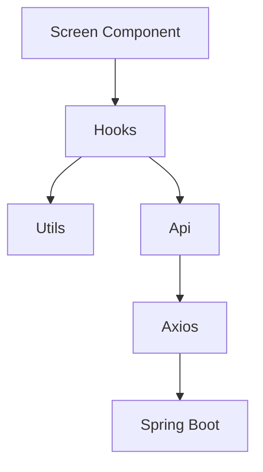
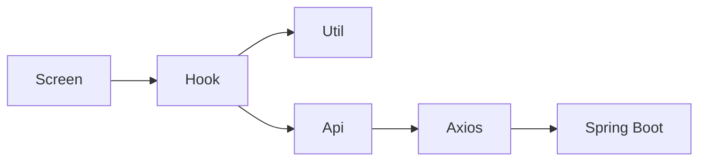
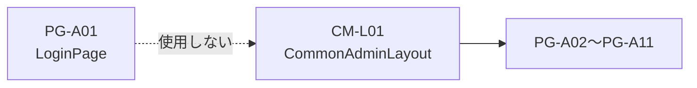
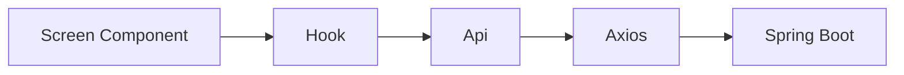

# フロントエンド構成設計書

---

# 1. 目的

本書は、NPO運営AIマネージャーの React フロントエンド構成を定義する。

画面設計書、API設計書、データベース設計書、バックエンド構成設計書を基に、以下を明確にする。

```text
フォルダ構成

画面構成

ルーティング

型定義

hooks構成

utils構成

api構成

状態管理方針

共通部品

Phase8拡張方針
```

---

本設計では以下を明確に分離する。

```text
Screen Component
＝画面

Hooks
＝状態管理・画面ロジック

Utils
＝変換処理・共通処理

Api
＝API通信

Axios
＝HTTPクライアント

Spring Boot
＝バックエンド
```

---

# 2. 技術構成

MVPでは以下を採用する。

```text
React

TypeScript

Vite

React Router

Axios

Tailwind CSS
```

---

## 状態管理

MVPでは Redux は導入しない。

Jotai は未導入とする。

```text
useState

useEffect

useMemo

useCallback

Custom Hooks
```

で構成する。

---

## API通信

API通信は Axios を利用する。

画面コンポーネントから直接 axios を呼ばない。

必ず api 層を経由する。

---

# 3. フロントエンド全体構成



---

## レイヤー責務

```text
Screen
↓
画面表示

Hooks
↓
状態管理・画面ロジック

Utils
↓
変換処理

Api
↓
API通信

Axios
↓
HTTP通信

Spring Boot
↓
業務処理
```

---

# 4. フォルダ構成

```text
src/

├─ api/
│
├─ hooks/
│
├─ types/
│
├─ utils/
│
├─ components/
│
├─ layouts/
│
├─ screen-layouts/
│
├─ routes/
│
├─ constants/
│
└─ assets/
```

---

## components

本番画面コンポーネントを配置する。

```text
auth

dashboard

organization

grants

evaluations

grant-cases

settings
```

---

## layouts

共通レイアウトを配置する。

```text
CommonAdminLayout.tsx
```

---

## screen-layouts

画面説明用TSXを配置する。

用途

```text
設計書

顧客説明

画面確認
```

本番ロジックを持たない。

---

## api

API通信を配置する。

例

```text
organizationProfileApi

charterArticleApi

activityRecordApi

grantMasterApi

aiEvaluationApi

evaluationHistoryApi

grantCaseApi

grantRequirementsCheckApi

nextActionApi

dashboardApi
```

---

## hooks

画面ロジックを配置する。

例

```text
useOrganizationProfile

useCharterArticles

useActivityRecords

useGrantMasters

useAiEvaluation

useEvaluationHistories

useGrantCases

useGrantCase

useRequirementChecks

useNextActions
```

---

## utils

変換処理・共通処理を配置する。

例

```text
dateFormatter

deadlineCalculator

statusLabelConverter

responseMapper

storageUrlBuilder
```

---

## types

型定義を配置する。

例

```text
OrganizationProfile

CharterArticle

ActivityRecord

GrantMaster

GrantCase

EvaluationHistory

GrantRequirementsCheck

NextAction
```

---

# 5. レイヤー責務



---

## Screen

責務

```text
JSX描画

イベント発火

Hook呼び出し
```

業務ロジックを持たない。

---

## Hooks

責務

```text
useState

useEffect

データ取得

状態管理

画面ロジック
```

---

## Utils

責務

```text
日付変換

ラベル変換

レスポンス変換

共通処理
```

---

## Api

責務

```text
GET

POST

PUT

PATCH

DELETE
```

API通信のみを担当する。

---

## Axios

責務

```text
BaseURL

Interceptor

共通設定
```

---

## 原則

```text
Screenは薄く保つ。

Hookに画面ロジックを集約する。

Utilsに変換処理を集約する。

Apiに通信処理を集約する。

責務を混在させない。
```

---

# 6. 画面構成

## 6-1. 画面一覧

| 図面番号 | 画面名               | 実装ファイル                    |
| -------- | -------------------- | ------------------------------- |
| PG-A01   | ログイン             | LoginPage.tsx                   |
| PG-A02   | 管理者ダッシュボード | DashboardPage.tsx               |
| PG-A03   | 団体基本情報管理     | OrganizationProfilePage.tsx     |
| PG-A04   | 定款条文管理         | ArticlePage.tsx                 |
| PG-A05   | 活動実績管理         | ProjectPage.tsx                 |
| PG-A06   | 助成金一覧           | GrantListPage.tsx               |
| PG-A06B  | 助成金マスター管理   | GrantFormPage.tsx               |
| PG-A07   | AI判定ワークスペース | AiWorkSpacePage.tsx             |
| PG-A08   | AI判定履歴           | EvaluationHistoryPage.tsx       |
| PG-A08B  | AI判定履歴詳細       | EvaluationHistoryDetailPage.tsx |
| PG-A09   | 助成金案件一覧       | GrantCaseListPage.tsx           |
| PG-A10   | 助成金案件詳細       | GrantCaseDetailPage.tsx         |
| PG-A11   | 設定                 | SettingPage.tsx                 |

---

## 6-2. 画面分類

```text
auth
↓
PG-A01

dashboard
↓
PG-A02

organization
↓
PG-A03
PG-A04
PG-A05

grants
↓
PG-A06
PG-A06B
PG-A07

evaluations
↓
PG-A08
PG-A08B

grant-cases
↓
PG-A09
PG-A10

settings
↓
PG-A11
```

---

## 6-3. 管理画面共通レイアウト

PG-A02〜PG-A11 は CM-L01 管理画面共通レイアウトを利用する。

PG-A01 は単独ページとする。



---

# 7. shared構成

## 7-1. sharedの考え方

複数画面で利用する部品・定数・処理は共通化する。

ただし、画面固有の状態やロジックは各画面Hookに閉じ込める。

---

## shared/components

共通UIを配置する。

例

```text
PageHeader

InfoCard

DataTable

RightInfoPanel

EmptyState

ConfirmDialog

LoadingOverlay

PdfPreviewPanel

StatusBadge

ModeSwitchButton
```

---

## shared/constants

共通定数を配置する。

例

```text
routes

statusLabels

apiConfig

panelSettings
```

---

## shared/hooks

複数画面で再利用するHooksを配置する。

例

```text
useRightPanel

useSessionStorage

useEvaluationLock

useApiError
```

---

## shared/utils

複数画面で再利用する関数を配置する。

例

```text
formatDate

formatCurrency

getDeadlineStatusLabel

getStatusLabel

buildStorageUrl
```

---

# 8. routes設計

## 8-1. 方針

画面遷移URLは routes 定数に集約する。

画面内でURL文字列を直接書かない。

---

## routes一覧

```text
loginPage

dashboardPage

organizationProfilePage

articlePage

projectPage

grantListPage

grantFormPage

aiWorkSpacePage

evaluationHistoryPage

evaluationHistoryDetailPage

grantCaseListPage

grantCaseDetailPage

settingPage
```

---

## URL一覧

```text
/login

/dashboard

/organization-profile

/articles

/projects

/grants

/grants/form

/ai-workspace/:grantMasterId

/evaluation-histories

/evaluation-histories/:evaluationHistoryId

/grant-cases

/grant-cases/:grantCaseId

/settings
```

---

## 動的ルート

```text
/ai-workspace/:grantMasterId

/evaluation-histories/:evaluationHistoryId

/grant-cases/:grantCaseId
```

---

## 遷移ルール

```text
PG-A06
↓
PG-A07
↓
PG-A10

PG-A08
↓
PG-A08B

PG-A09
↓
PG-A10
```

---

# 9. types設計

## 9-1. 方針

型定義は `types` に集約する。

画面内で同じ型を重複定義しない。

---

## 主な型

```text
OrganizationProfile

CharterArticle

ActivityRecord

GrantMaster

GrantCase

EvaluationHistory

GrantRequirementsCheck

NextAction
```

---

## DTO型

API入出力用の型を定義する。

例

```text
GrantCaseApiResponse

GrantCaseUpdateRequest

AiEvaluationRequest

AiEvaluationResponse

EvaluationHistoryApiResponse

RequirementCheckUpdateRequest

NextActionRequest
```

---

## Union型

ステータスはUnion型で定義する。

例

```text
ExaminationStatus

ExternalAuditStatus

CheckStatus

AiSuitability

AiRecommendationLevel

DeadlineStatus
```

---

## ViewModel

必要に応じて画面表示用型を定義する。

例

```text
GrantCaseViewModel

EvaluationHistoryViewModel

DashboardSummaryViewModel
```

---

# 10. hooks設計

## 10-1. 方針

画面ロジックは hooks に集約する。

Screen Component は Hook を呼び出して表示に専念する。

---

## 主なHooks

```text
useOrganizationProfile

useCharterArticles

useActivityRecords

useGrantMasters

useGrantForm

useAiEvaluation

useEvaluationHistories

useEvaluationHistoryDetail

useGrantCases

useGrantCaseDetail

useRequirementChecks

useNextActions

useDashboard
```

---

## Hookの責務

```text
API呼び出し

loading管理

error管理

form state管理

mode管理

検索条件管理

保存処理

キャンセル処理

アーカイブ処理
```

---

## Hookが持たない責務

```text
JSX描画

CSS className管理

画面全体レイアウト定義
```

---

# 11. api設計

## 11-1. 方針

API通信は api 層に集約する。

Hook は api 関数を呼び出す。

Screen Component は api を直接呼び出さない。

---

## api一覧

```text
organizationProfileApi

charterArticleApi

activityRecordApi

grantMasterApi

aiEvaluationApi

evaluationHistoryApi

grantCaseApi

grantRequirementsCheckApi

nextActionApi

dashboardApi
```

---

## apiの責務

```text
GET

POST

PUT

PATCH

DELETE
```

通信のみを担当する。

---

## apiが持たない責務

```text
画面表示判断

ステータスラベル変換

フォーム状態管理

検索条件管理
```

---

## axios共通化

axios設定は共通化する。

```text
baseURL

headers

error handling

timeout
```

---

## API呼び出し構造



---

# 12. 状態管理方針

## 12-1. 基本方針

MVPでは Redux は導入しない。

Jotai も未導入とする。

状態管理は以下を中心に行う。

```text
useState

useEffect

useMemo

useCallback

Custom Hooks
```

---

## 12-2. 状態の配置

```text
画面固有状態
↓
各画面Hook

複数画面共通状態
↓
shared hooks

永続化が必要な一時状態
↓
sessionStorage

サーバー状態
↓
api経由で再取得
```

---

## 12-3. 管理対象

```text
フォーム入力

検索条件

一覧選択状態

参照モード / 編集モード

保存中状態

削除確認ダイアログ

アーカイブ確認ダイアログ

APIエラー

ローディング状態
```

---

# 13. AI判定ロック

## 対象画面

```text
PG-A07 AI判定ワークスペース
```

---

## 目的

AI判定中の二重実行や画面遷移を防止する。

```text
二重判定防止

二重案件生成防止

中断による不整合防止
```

---

## ロック対象

```text
AI判定ボタン

戻るボタン

左サイドメニュー

設定

ログアウト

画面内リンク
```

---

## 表示

```text
AI判定中です。

しばらくお待ちください。
```

---

## 成功時

```text
AI判定成功

GrantCase生成

PG-A10へ遷移
```

---

## 失敗時

```text
エラー表示

ロック解除

再実行可能
```

---

# 14. sessionStorage方針

## 利用目的

検索条件の一時保持に利用する。

---

## 対象画面

```text
PG-A09

PG-A10
```

---

## 保存対象

```text
キーワード

検討状況

外部審査結果

AI適合性

AI推奨度

締切状態

アーカイブ表示
```

---

## 方針

```text
PG-A09で検索条件を保存する。

PG-A10からPG-A09へ戻る場合に復元する。

ログアウト時にクリアする。
```

---

## 注意

sessionStorage は業務データの永続保存には使わない。

---

# 15. PDFプレビュー

## 共通部品

```text
PdfPreviewPanel
```

---

## 表示URL

```text
/storage/{fileName}
```

---

## 利用画面

```text
PG-A10
```

将来的には以下でも利用する。

```text
PG-A06B

文書管理画面

添付ファイル管理画面
```

---

## 方針

```text
MVPではPDFアップロードは実装しない。

既存ファイル名をもとに表示する。

Phase8で添付ファイル管理と統合する。
```

---

# 16. CM-L01 共通レイアウト

## 対象

PG-A02〜PG-A11 は CM-L01 管理画面共通レイアウトを利用する。

PG-A01 は単独ページとする。

---

## 構成

```text
左サイドメニュー

中央メインコンテンツ

右サイド情報パネル
```

---

## 右サイド情報パネル

初期表示

```text
PG-A02
↓
OFF

PG-A03〜PG-A11
↓
ON
```

---

## ログアウト

ログアウト時は以下を行う。

```text
sessionStorage をクリアする。

PG-A01 へ遷移する。
```

---

# 17. Phase8拡張予約

Phase8 では以下の拡張を想定する。

```text
添付ファイル管理

PDF取込

文書管理

Knowledge化

RAG検索

AIプロバイダ切替

ローカルLLM
```

---

## 追加予定領域

```text
storage

documents

knowledge

rag

ai-providers
```

---

## 想定追加ファイル

```text
attachmentApi

documentApi

knowledgeSourceApi

ragSearchApi

aiProviderApi
```

---

## 想定追加Hooks

```text
useAttachments

useDocuments

useKnowledgeSources

useRagSearch

useAiProviders
```

---

# 18. 実装規律

## 新規ファイル

新規ファイルは全文提案する。

---

## 修正

修正も基本的に全文差し替えを優先する。

---

## 大規模修正

大規模画面修正は以下の順に分割する。

```text
1. types

2. utils

3. api

4. hooks

5. screen component
```

---

## Git運用

ブランチ作成、main統合、ブランチ削除は Fork で行う。

---

# 19. 設計原則

```text
Screen Component は薄く保つ。

状態管理は hooks に寄せる。

変換処理は utils に寄せる。

API通信は api に寄せる。

HTTP設定は axios に寄せる。

型は types に集約する。

URLは routes に集約する。

ステータス表示は constants に集約する。

AIは最終判断を行わない。

最終判断は利用者が行う。

将来のKnowledge化とRAGを前提とする。
```
