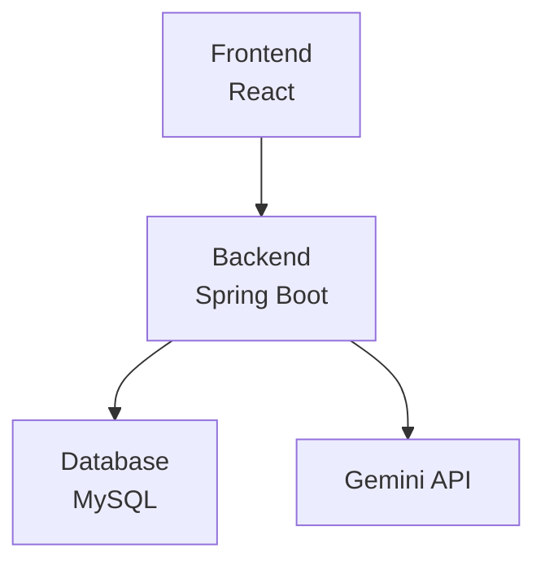
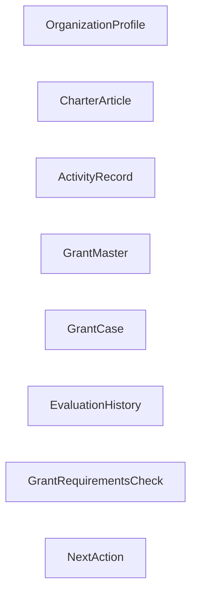
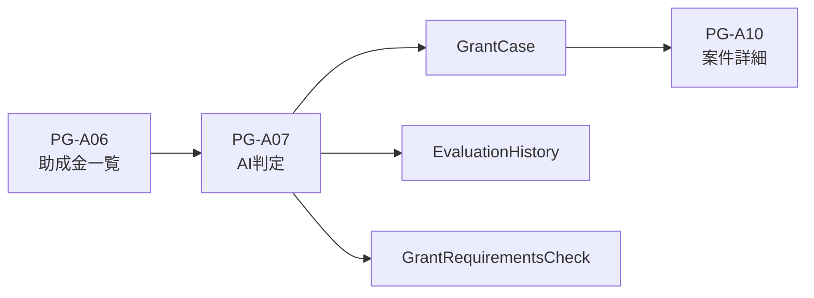
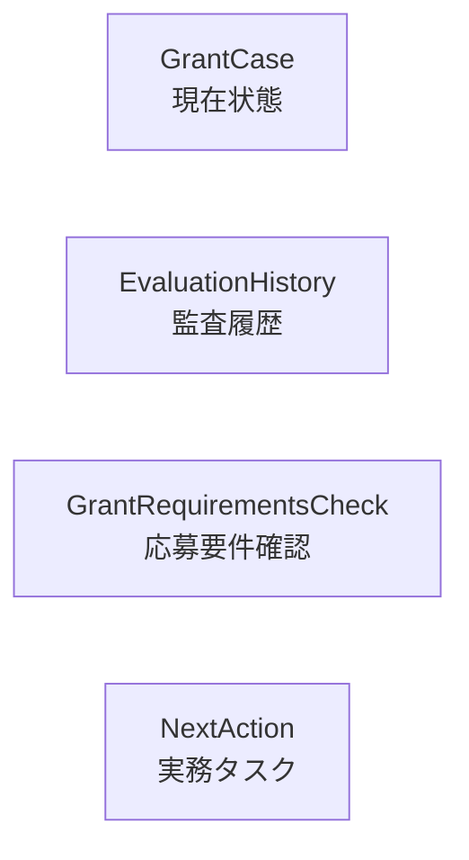
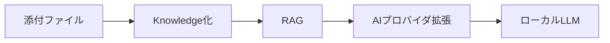

# システム概要設計書

---

# 1. システム概要

NPO運営AIマネージャーは、NPO法人や地域団体における助成金活用業務を支援するシステムである。

団体情報、定款、活動実績などの組織知を蓄積し、それらを根拠としてAIによる助成金適合性評価を行う。

AIは最終判断を行わない。

利用者がAIの提示した根拠を確認し、組織として意思決定を行う。

---

# 2. システム目的

本システムは以下を目的とする。

```text
団体情報の一元管理

組織知の蓄積

助成金情報の管理

AIによる適合性評価

判定根拠の可視化

検討履歴の保存

案件管理の効率化
```

---

# 3. システムコンセプト

本システムは

```text
助成金応募意思決定OS
```

である。

AIは判断者ではない。

AIは

```text
整理する

根拠を示す

確認事項を提示する
```

役割を担う。

最終判断は利用者が行う。

---

# 4. システム全体構成



---

## フロントエンド

```text
React

TypeScript

Vite

React Router

Axios

Tailwind CSS
```

---

## バックエンド

```text
Spring Boot

MyBatis
```

---

## データベース

```text
MySQL
```

---

# 5. 主要データ



---

## 組織知

```text
OrganizationProfile

CharterArticle

ActivityRecord
```

---

## 助成金

```text
GrantMaster
```

---

## 案件管理

```text
GrantCase
```

---

## AI監査履歴

```text
EvaluationHistory
```

---

## 応募要件確認

```text
GrantRequirementsCheck
```

---

## 実務タスク

```text
NextAction
```

---

# 6. AI判定主線



---

## AI判定生成対象

```text
GrantCase

EvaluationHistory

GrantRequirementsCheck
```

---

## AI判定後

PG-A09を経由せず、

```text
PG-A10
助成金案件詳細
```

へ直接遷移する。

---

# 7. 現在状態と履歴の分離



---

## GrantCase

管理対象

```text
検討状況

外部審査結果

検討メモ
```

---

## EvaluationHistory

管理対象

```text
AI判定結果

判定理由

判定根拠

スナップショット

判定日時
```

---

## GrantRequirementsCheck

管理対象

```text
応募要件確認
```

---

## NextAction

管理対象

```text
実務タスク
```

---

# 8. MVP実装範囲

対象画面

```text
PG-A01 ～ PG-A11

PG-A06B

PG-A08B
```

---

対象機能

```text
団体情報管理

定款管理

活動実績管理

助成金管理

AI判定

AI判定履歴

案件管理

応募要件確認

次のアクション管理
```

---

# 9. AIの位置付け

AIが行うこと

```text
適合性評価

推奨度判定

判定理由生成

判定根拠生成

追加確認事項生成
```

---

AIが行わないこと

```text
最終意思決定

応募可否決定

自動申請
```

---

最終判断

```text
利用者
```

---

# 10. 将来構想



---

## Phase8以降

```text
添付ファイル管理

PDF取込

Knowledge化

RAG

AIプロバイダ拡張

ローカルLLM
```

---

# 11. 設計原則

```text
AIは触媒である。

最終判断は利用者が行う。

現在状態と履歴を分離する。

責務を混在させない。

説明可能性を重視する。

トレーサビリティを確保する。

Knowledge化とRAGを前提とする。
```
