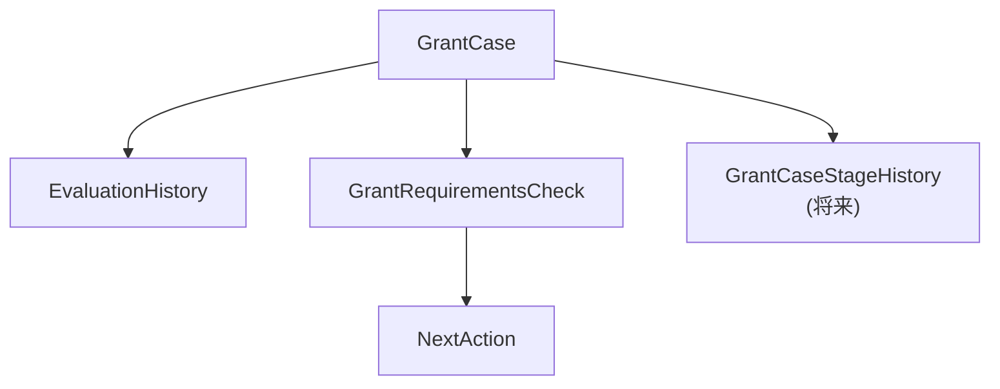
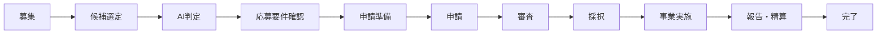

# 助成金案件ライフサイクル管理構想

---

# 1. 目的

本書は、NPO運営AIマネージャーにおける助成金案件ライフサイクル管理の将来構想を定義する。

MVPでは、

```text
AI判定

案件管理

応募要件確認

次のアクション管理
```

までを対象とする。

将来的には、

```text
募集

↓

候補登録

↓

申請準備

↓

申請

↓

審査

↓

採択

↓

事業実施

↓

報告・精算

↓

完了
```

までを一元管理する案件管理基盤へ発展させる。

---

# 2. MVPとの関係

MVPでは以下を実装する。

```text
PG-A09
助成金案件一覧

PG-A10
助成金案件詳細

AI判定

AI判定履歴

応募要件確認

次のアクション管理
```

---

MVPでは

```text
caseStage
```

は実装しない。

将来的な拡張ポイントとして設計を残す。

---

# 3. 状態管理レイヤー

将来的には助成金案件に3つの状態管理レイヤーを持たせる。

---

## 検討状況

団体側の判断状態

```text
UNCONFIRMED

UNDER_REVIEW

SKIPPED
```

---

管理テーブル

```text
GrantCase
```

---

## 外部審査結果

助成元側の審査状態

```text
NO_RESPONSE

UNDER_AUDIT

ADOPTED

REJECTED
```

---

管理テーブル

```text
GrantCase
```

---

## 案件ステージ

将来実装

```text
OPEN

CANDIDATE_REGISTERED

PREPARING_APPLICATION

APPLIED

ADOPTED

IN_PROGRESS

REPORTING_AND_SETTLEMENT

COMPLETED

WITHDRAWN
```

---

管理テーブル

```text
GrantCase
```

---

# 4. 現在状態と履歴の分離

本システムでは、

```text
GrantCase
＝現在状態
```

と

```text
EvaluationHistory
＝AI判定履歴
```

を分離する。

---

## GrantCase

保持する情報

```text
検討状況

外部審査結果

案件ステージ（将来）
```

---

## EvaluationHistory

保持する情報

```text
AI適合性

AI推奨度

判定理由

判定根拠

判定日時
```

---

案件状態が変更されても、

AI判定履歴は保持する。

---

# 5. 将来構造



---

## 責務

```text
GrantCase
↓
現在状態

EvaluationHistory
↓
監査履歴

GrantRequirementsCheck
↓
応募要件確認

NextAction
↓
実務タスク

GrantCaseStageHistory
↓
案件ステージ履歴（将来）
```

---

# 6. 将来の画面構想

## 助成金案件一覧

将来的には、

```text
案件ステージ
```

による検索を追加する。

例

```text
募集中

候補登録

申請準備中

申請済

採択

事業実施中

報告・精算

完了

辞退
```

---

## 助成金案件詳細

将来的には、

```text
案件ステージ

担当者

案件履歴
```

を追加する。

---

## 案件ステージ履歴

将来的には、

案件ステージ変更履歴を保持する。

追加想定テーブル

```text
grant_case_stage_histories
```

保持内容

```text
grantCaseId

beforeStage

afterStage

changedAt

changedBy

changeReason
```

---

## 担当者管理

将来的には、

```text
主担当

副担当

承認者
```

を管理する。

---

## ステージとタスク連動

将来的には、

案件ステージに応じて

```text
NextAction
```

を自動生成する。

例

```text
申請準備中
↓
申請書作成

添付資料確認

予算確認
```

---

## ステージと応募要件連動

将来的には、

```text
GrantRequirementsCheck
```

の完了状況に応じて

案件ステージを進行できるようにする。

---

# 7. 最終ビジョン



---

本システムは、

```text
助成金案件管理

AI判定

応募要件確認

実務タスク管理

組織知蓄積
```

を統合した、

```text
助成金応募意思決定OS
```

として発展する。

---

AIは判断者ではない。

AIは

```text
整理

比較

不足情報指摘

根拠提示
```

を行う。

最終判断は人間が行う。

---

将来的には、

```text
PDF解析

Knowledge化

RAG

組織知検索

ローカルLLM
```

と連携し、

助成金案件と組織知を横断的に活用できる環境を構築する。
