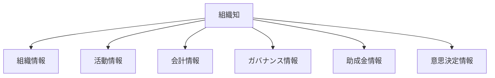
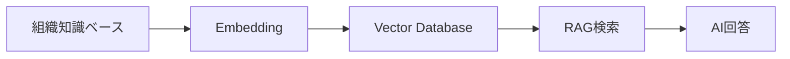
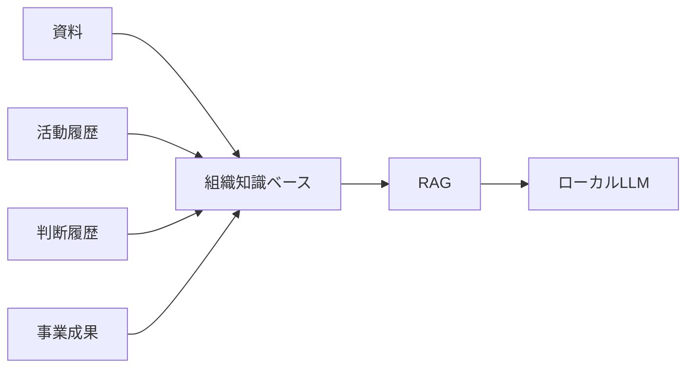

# 組織知識ベース構想

---

# 1. 目的

本書は、NPO運営AIマネージャーにおける組織知識ベース（Organization Knowledge Base）の将来構想を定義する。

本システムは助成金案件管理を出発点とする。

最終的には、

```text
組織内に蓄積された知識

活動履歴

意思決定履歴

事業成果
```

を管理・検索・活用できる知識基盤へ発展することを目指す。

---

# 2. MVPとの関係

MVPでは以下を知識資産として管理する。

```text
OrganizationProfile

CharterArticle

ActivityRecord

GrantCase

EvaluationHistory

GrantRequirementsCheck

NextAction
```

---

対応画面

```text
PG-A03

PG-A04

PG-A05

PG-A08

PG-A09

PG-A10
```

---

MVPでは、

```text
PDF検索

OCR

RAG

Knowledge検索
```

は実装しない。

---

将来的には、

```text
事業計画書

事業報告書

決算書

総会資料

議事録

助成金申請書

実績報告書

契約書
```

まで管理対象を拡張する。

---

# 3. 知識分類



---

## 組織情報

```text
団体基本情報

定款

規程類
```

---

## 活動情報

```text
活動実績

事業計画

事業報告

イベント実績
```

---

## 会計情報

```text
決算書

予算書
```

---

## ガバナンス情報

```text
総会資料

理事会資料

議事録
```

---

## 助成金情報

```text
募集要項

申請書

採択通知

実績報告書

精算資料
```

---

## 意思決定情報

本システム独自の知識分類

```text
GrantCase

EvaluationHistory

GrantRequirementsCheck

NextAction
```

助成金案件管理は、

将来の組織知識ベース構築の入口として位置付ける。

---

# 4. PDF中心設計

基本方針

```text
原本を保存する

↓

必要に応じて解析する

↓

構造化する

↓

知識化する
```

---

MVP

```text
ローカル配置

ファイル名管理

PDFプレビュー
```

のみを実装する。

---

対象例

```text
募集要項

定款

活動報告書

事業計画書
```

---

将来的には、

```text
PDF

Word

Excel

画像
```

を管理対象とする。

---

保存先は選択可能とする。

```text
ローカルストレージ

NAS

クラウドストレージ
```

---

原則

```text
原本を失わない。
```

---

# 5. 構造化データ

AI活用のため、

原本ファイルと構造化データの両方を保持する。

---

## 定款

```text
定款PDF
↓
CharterArticle
```

---

## 活動実績

```text
活動報告書
↓
ActivityRecord
```

---

## AI判定履歴

```text
AI判定結果
↓
EvaluationHistory
```

---

## 応募要件確認

```text
募集要項
↓
GrantRequirementsCheck
```

---

## 実務タスク

```text
応募要件確認
↓
NextAction
```

---

構造化データ生成は、

MVPでは手動登録とする。

将来的には、

```text
OCR

レイアウト解析

AI抽出
```

による自動生成へ発展する。

---

# 6. AIとRAG

AI判定は組織知識ベースを根拠として利用する。

---

MVPで利用する知識

```text
OrganizationProfile

CharterArticle

ActivityRecord

GrantMaster
```

---

将来的には、

```text
事業計画書

事業報告書

議事録

決算書
```

も利用対象とする。

---

## 横断検索

将来的には、

```text
子ども食堂
```

などのキーワードから、

```text
活動報告書

事業計画書

助成金申請書

実績報告書

議事録

定款

活動実績
```

を横断検索できるようにする。

---

## 意思決定情報検索

本システム独自の検索対象

```text
GrantCase

EvaluationHistory

GrantRequirementsCheck

NextAction
```

---

## RAG構成



---

## AIの役割

AIは

```text
検索

整理

比較

根拠提示
```

を行う。

AIは判断者ではない。

最終判断は人間が行う。

---

# 7. 最終ビジョン



---

本システムは、

```text
助成金管理システム
```

で終わらない。

最終的には、

```text
組織知識管理

意思決定支援

案件管理

AI活用
```

を統合した

```text
組織知プラットフォーム
```

へ発展する。

---

将来的には、

```text
Knowledge化

RAG

組織知検索

ローカルLLM
```

と連携し、

組織内に蓄積された知識を次の意思決定へ活用できる環境を構築する。
