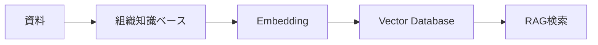
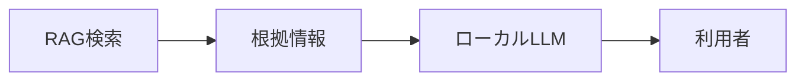
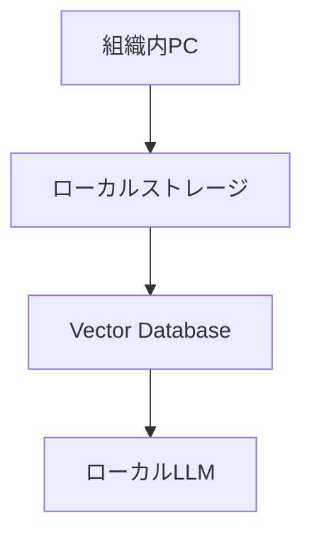
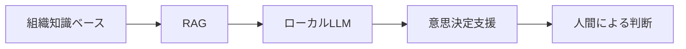

# RAG・ローカルLLM構想

---

# 1. 目的

本書は、

NPO運営AIマネージャーにおける

```text
RAG
(Retrieval Augmented Generation)

ローカルLLM
```

の将来構想を定義する。

---

本システムの目的は、

AIに判断させることではない。

組織内に蓄積された知識を検索し、

人間の意思決定を支援することを目的とする。

---

AIは

```text
検索

整理

比較

根拠提示
```

を行う。

最終判断は人間が行う。

---

# 2. MVPとの関係

MVPでは、

以下の構造化データのみを利用する。

```text
OrganizationProfile

CharterArticle

ActivityRecord

GrantMaster
```

---

AI判定結果は

```text
EvaluationHistory
```

へ保存する。

---

MVPでは以下は実装しない。

```text
PDF全文検索

OCR

Embedding

Vector Database

RAG

ローカルLLM
```

---

Phase8以降で、

```text
PDF

Word

Excel

画像

GrantCase

EvaluationHistory

GrantRequirementsCheck

NextAction
```

を知識資産として活用する。

---

# 3. RAGの役割

RAGの主目的は、

```text
必要な根拠を探す
```

ことである。

---

## 想定構成



---

## 検索対象

```text
活動報告書

事業計画書

議事録

決算書

募集要項

過去申請書

GrantCase

EvaluationHistory

GrantRequirementsCheck

NextAction
```

---

## RAGの責務

```text
検索

抽出

根拠収集
```

---

RAGは判断を行わない。

---

# 4. ローカルLLMの役割

ローカルLLMは、

RAGによって取得された根拠を整理し、

利用者へ説明する役割を担う。

---

## 想定構成



---

## ローカルLLMの責務

```text
要約

比較

不足情報整理

説明生成
```

---

行わないこと

```text
応募判断

採択保証

意思決定
```

---

## 将来的な参照対象

```text
GrantCase

EvaluationHistory

GrantRequirementsCheck

NextAction
```

---

## 過去判断の活用

例

```text
類似案件

↓

過去のAI判定履歴

↓

見送り理由

↓

採択実績

↓

改善点
```

---

# 5. 福祉分野への対応

本システムは、

```text
福祉

教育

子ども支援
```

分野での利用を想定する。

---

そのため、

```text
個人情報

支援記録

相談記録
```

を扱う可能性がある。

---

## 基本方針

クラウドAI必須を前提としない。

利用団体が選択できるようにする。

```text
クラウドAI

または

ローカルLLM
```

---

## 想定構成



---

## 利点

```text
個人情報保護

機密情報保護

インターネット非依存

長期運用
```

---

# 6. AI支援機能

将来的には、

以下の支援を実現する。

---

## 助成金判定支援

```text
対象要件との適合分析

不足情報抽出

必要資料抽出

過去案件比較
```

---

## 不採択分析支援

```text
不採択案件検索

改善ポイント提示

採択案件比較
```

---

## 応募要件確認支援

```text
未確認項目抽出

不足資料抽出

追加確認事項抽出
```

---

## タスク支援

```text
未完了タスク

期限超過リスク

よく発生するタスク
```

---

## 組織知検索

例

```text
子ども食堂
```

↓

```text
活動報告書

事業計画書

議事録

GrantCase

EvaluationHistory

GrantRequirementsCheck

NextAction
```

を横断検索する。

---

# 7. 最終ビジョン



---

本システムの目的は、

AIに判断させることではない。

---

AIが、

```text
どこに根拠があるか

何が不足しているか

過去に何を行ったか

過去に何を判断したか
```

を提示する。

---

最終判断は人間が行う。

---

最終的には、

```text
組織知管理

案件管理

意思決定支援

AI活用
```

を統合した

```text
組織知プラットフォーム

（意思決定OS）
```

へ発展する。
