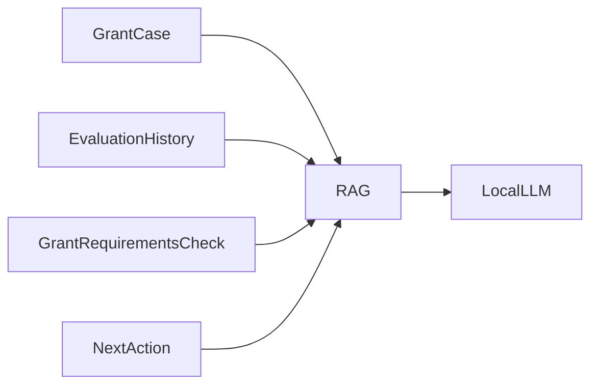
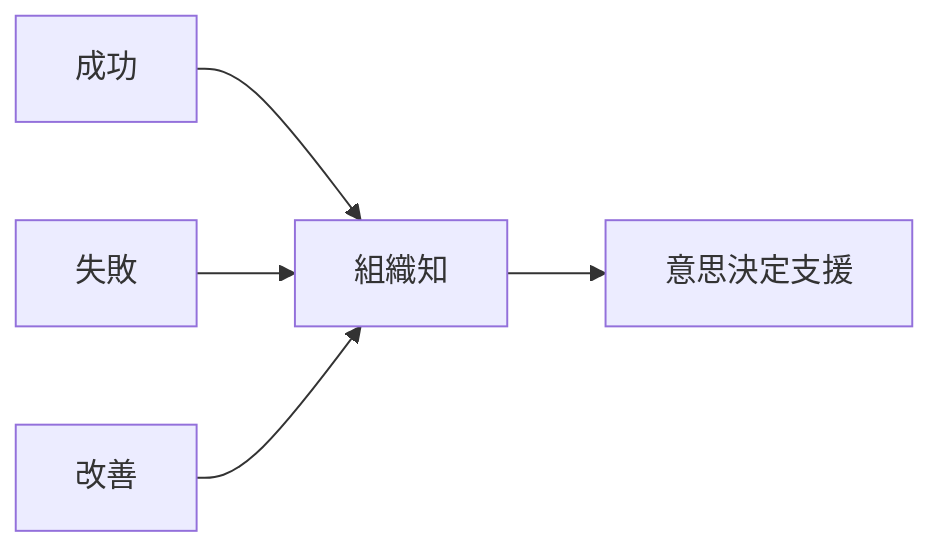

# 不採択分析構想

---

# 1. 目的

本書は、

助成金案件における採択・不採択結果を蓄積し、

将来的に不採択要因の分析や申請品質向上へ活用するための構想を定義する。

---

本システムは、

単に助成金案件を管理するだけではない。

過去の

```text
判断

申請

審査結果

改善
```

を組織知として蓄積し、

組織全体の意思決定品質向上を目指す。

---

# 2. MVPとの関係

MVPでは、

以下を管理する。

```text
GrantCase

EvaluationHistory

GrantRequirementsCheck

NextAction

検討メモ
```

---

外部審査結果は、

```text
NO_RESPONSE

UNDER_AUDIT

ADOPTED

REJECTED
```

で管理する。

---

MVPでは、

不採択理由そのものは管理しない。

管理するのは、

```text
採択

不採択
```

という結果のみである。

---

将来的には、

以下を追加する。

```text
審査コメント

不採択理由分類

改善メモ
```

---

# 3. 不採択分析の役割

本システムでは、

```text
GrantCase
＝現在状態

EvaluationHistory
＝AI判定履歴

GrantRequirementsCheck
＝応募要件確認

NextAction
＝実務タスク
```

を分離して管理する。

---

これらを組み合わせることで、

```text
成功パターン

失敗パターン

改善ポイント
```

を分析できるようにする。

---

## 分析例

```text
AI判定
＝適合

↓

結果
＝不採択
```

---

```text
AI判定
＝要確認

↓

結果
＝採択
```

---

差異の発生要因を分析する。

---

## 不採択案件の価値

不採択案件は失敗ではない。

不採択案件には、

```text
なぜ応募したか

何が不足していたか

何を確認したか

どのタスクを実施したか
```

という重要な知識が含まれる。

---

# 4. 将来の分析機能

将来的には、

以下の分析を行う。

---

## AI判定と実結果の比較

```text
AI適合性

AI推奨度

採択結果
```

を比較する。

---

## 助成金別採択率分析

例

```text
財団別採択率

年度別採択率

分野別採択率
```

---

## 応募要件分析

```text
未確認項目

不足資料

確認漏れ
```

を分析する。

---

## 実務品質分析

```text
未完了タスク

期限超過

よく発生する作業
```

を分析する。

---

## 組織学習支援

```text
採択案件で共通していた要素

不採択案件で不足していた要素

よく発生する改善ポイント
```

を抽出する。

---

# 5. AIとの関係

将来的には、

RAGとローカルLLMを利用する。

---



---

AIは、

```text
検索

比較

改善点抽出

根拠提示
```

を行う。

---

AIは、

```text
応募判断

採択保証

最終意思決定
```

を行わない。

---

最終判断は人間が行う。

---

# 6. 最終ビジョン



---

本システムは、

```text
採択案件だけを学ぶ組織
```

ではなく、

```text
成功

失敗

改善
```

のすべてを学習できる組織を支援する。

---

不採択案件は、

```text
失敗データ
```

ではない。

---

不採択案件は、

```text
将来の成功につながる知識資産
```

である。

---

本システムは、

```text
助成金案件管理

組織知蓄積

意思決定支援

AI活用
```

を統合した

```text
組織知プラットフォーム

（意思決定OS）
```

へ発展する。
