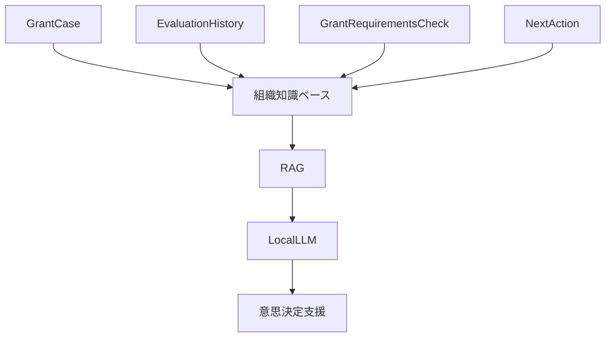
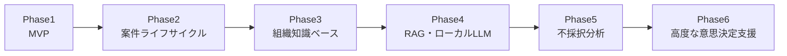
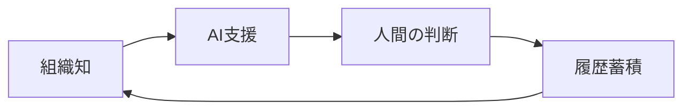

# 将来構想ロードマップ

---

# 1. 目的

本書は、

NPO運営AIマネージャーのMVP以降の発展構想を整理するためのロードマップである。

---

本システムは、

```text
助成金管理システム
```

から、

```text
組織知管理プラットフォーム

（意思決定OS）
```

へ発展することを目指す。

---

AIは判断者ではない。

AIは、

```text
検索

整理

比較

根拠提示

分析
```

を支援する。

最終判断は人間が行う。

---

# 2. MVPと将来構想

## MVP

```text
団体情報管理

定款管理

活動実績管理

助成金管理

AI判定

AI判定履歴

案件管理

応募要件確認

次のアクション管理
```

---

## MVPで実装しないもの

```text
案件ステージ管理

組織知識ベース

OCR

RAG

ローカルLLM

権限管理

複数団体管理
```

---

# 3. 4つの発展軸

本システムは、

4つの方向へ発展する。

---

## ① 助成金案件ライフサイクル管理

```text
募集

↓

申請準備

↓

申請

↓

採択

↓

事業実施

↓

報告・精算

↓

完了
```

詳細

```text
grant-lifecycle-management.md
```

---

## ② 組織知識ベース

組織内の資料と知識を蓄積する。

詳細

```text
organization-knowledge-base.md
```

---

## ③ RAG・ローカルLLM

知識検索と説明可能性を強化する。

詳細

```text
rag-and-local-llm.md
```

---

## ④ 不採択分析

成功・失敗・改善を組織知として活用する。

詳細

```text
rejection-analysis.md
```

---

## 全体構造



---

# 4. Phaseロードマップ



---

## Phase1

```text
MVP
```

---

## Phase2

```text
助成金案件ライフサイクル管理
```

---

## Phase3

```text
組織知識ベース構築
```

---

## Phase4

```text
RAG

ローカルLLM
```

---

## Phase5

```text
採択・不採択分析
```

---

## Phase6

```text
高度な意思決定支援
```

---

# 5. 最終ビジョン



---

本システムは、

```text
成功

失敗

改善
```

を組織知として蓄積する。

---

そして、

```text
組織知管理

案件管理

意思決定支援

AI活用
```

を統合した

```text
組織知管理プラットフォーム

（意思決定OS）
```

へ発展する。

---

助成金案件は入口である。

最終的な目的は、

```text
組織全体の学習と意思決定品質向上
```

である。
